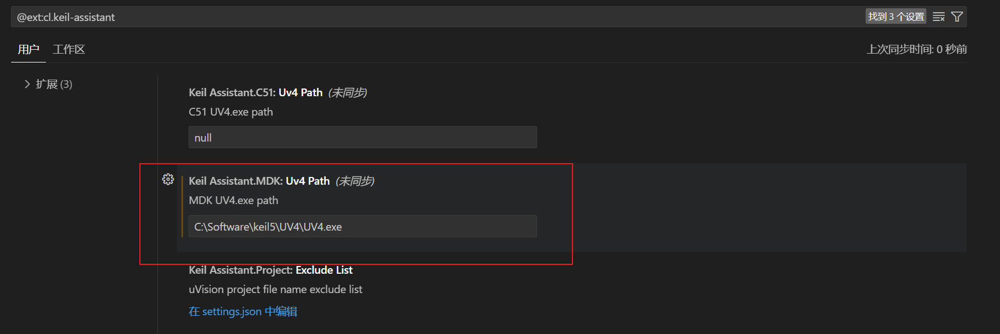
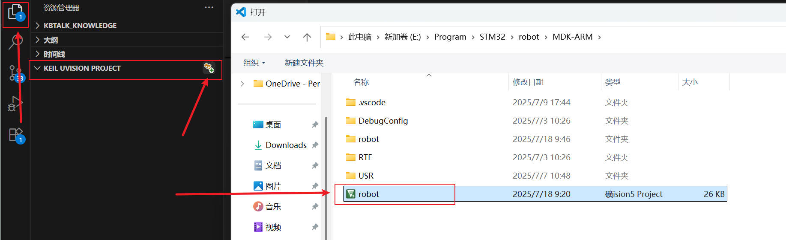

::: tip
此系列文档，侧重于功能的实现，会省略原理部分。

由于STM32的常用外设目前教程较多、非常丰富，需要原理学习的自行百度，或参考正点原子及野火的教程。
:::

## 开发软件
---
本教程将使用`STM32CubeMX`、`Keil5`、`Vscode`三款软件进行项目开发。

### STM32CubeMX

`STM32CubeMX`是 `STMicroelectronics`（意法半导体）推出的一款图形化配置工具，专门用于 STM32 微控制器的`工程初始化配置、生成`。

<LinkCard title="STM32CubeMX下载链接" href="https://www.st.com.cn/zh/development-tools/stm32cubemx.html" />

::: note
首次使用，需要注册账号。此账号用于软件的下载和后期软件的使用。
:::

### Keil5

对于STM32需要Keil5进行开发，不建议使用keil4。

<LinkCard title="Keil5百度网盘下载链接" href="https://pan.baidu.com/s/1kAFGKsH4CJ8CqLQgfJPdLQ?pwd=6666" />

[安装教程](https://mp.weixin.qq.com/s/xnSyBCdP94kTttqVqHZyNg?scene=1&click_id=1)

::: warning
Keil5本身是不包含芯片包的，需要根据STM32的芯片型号单独进行安装。

[STM32F1xx系列芯片包下载链接](https://www.keil.arm.com/packs/stm32f1xx_dfp-keil/boards/)
:::

### Vscode

::: steps

1. `步骤 1` 安装Vscode

    <LinkCard title="Vscode下载链接" href="https://code.visualstudio.com/Download" />

2. `步骤 2` 安装插件

    在插件管理中搜索并安装`Keil Assistant`。
3. `步骤 3` 添加Keil5路径

    在桌面上找到keil5的安装路径，如`C:\Software\keil5\UV4\UV4.exe`。

    进入插件设置，将路径填入。

    

4. `步骤 4` 打开工程

    

    ::: note
    在打开工程前，需要在Keil中完成其他基本配置，如编译器的选择、下载器的选择。
    :::
:::

## 推荐资料
---
1. [stm32 pack下载链接](https://www.keil.arm.com/devices/)
2. [正点原子资料下载中心](http://47.111.11.73/docs/boards/stm32/zdyz_stm32f103_warshipV4.html)
3. [视频教程](https://www.bilibili.com/video/BV12v4y1y7uV/?spm_id_from=333.999.0.0&vd_source=7bc61b3be57793288420595a48ac0104)