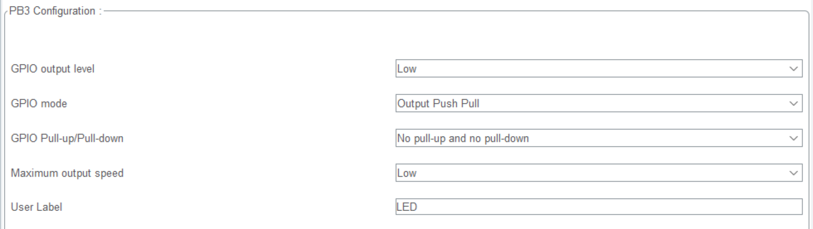

## 前言

### GPIO工作模式

::: info
对STM32的IO口配置与51单片机不同。

51单片机的IO口只需定义引脚即可，即可使用输入输出模式；

但对与STM32的IO口只能选择1种工作模式。
:::

对于STM32单片机，GPIO共有==8种=={.important}  [+工作模式]工作模式。

[+工作模式]:
    GPIO大类上分为`输入`、`输出`模式，但是在使用中需要配置成具体的工作模式（8种工作模式种的1种）。

1. 输入浮空

引脚内部不接上拉/下拉电阻[+电阻]，电平由外部电路决定。

[+电阻]:
    上拉电阻的作用：当无外界信号输入时，可以将引脚电平维持在高电平。

    下拉电阻的作用：当无外界信号输入时，可以将引脚电平维持在低电平。

2. 输入上拉

内部通过电阻接VCC，默认高电平，外力拉低时变低。

3. 输入下拉

内部通过电阻接GND，默认低电平，外力拉高时变高。

4. 模拟输入

引脚直接连接ADC，读取连续电压值（0~3.3V）。

5. 开漏输出

只能主动拉低电平（开闸放水），高电平靠外部上拉电阻（如I²C）。

6. 推挽输出

MOS管"推"（输出高）和"拉"（输出低）配合，强驱动高低电平。

7. 复用开漏

将开漏输出交给外设控制（如I²C的SCL/SDA）。

8. 复用推挽

将推挽输出交给外设控制（如USART_TX、SPI_SCK）。

::: info
STM32单片机的引脚可以通过配置来实现上拉、下拉电阻。

但不代表，在硬件电路设计时不需要设计合适的电阻。
:::

### GPIO工作模式选择

对于LED需要较大的驱动能力，所以将GPIO的工作模式配置成`推挽输出`。

## 工程配置



将对应引脚配置为推挽输出模式。

* GPIO Output Level 

引脚初始化电平，可以选择高电平、低电平。

* GPIO Mode 

GPIO模式，在输出模式下可以选择开漏输出、推挽输出。

* GPIO Pull-up/Pull-down

推挽输出模式下，上下拉电阻通常不需要启用，因为引脚已能稳定输出高低电平。

* Maximum Output Speed

IO口输出速率。

* User Label

用户标签，可以自定义引脚名称。

::: warning

 对于驱动LED、蜂鸣器等设备，将IO口配置成`推挽输出`模式；初始电平根据需求设定；不进行上拉、下拉电阻；输出速率任意。
:::

## 程序设计

使用`HAL_GPIO_WritePin`完成IO口高低电平的控制。

```c
HAL_GPIO_WritePin(LED_GPIO_Port, LED_Pin, GPIO_PIN_RESET);//低电平
HAL_GPIO_WritePin(LED_GPIO_Port, LED_Pin, GPIO_PIN_SET);//低电平
```