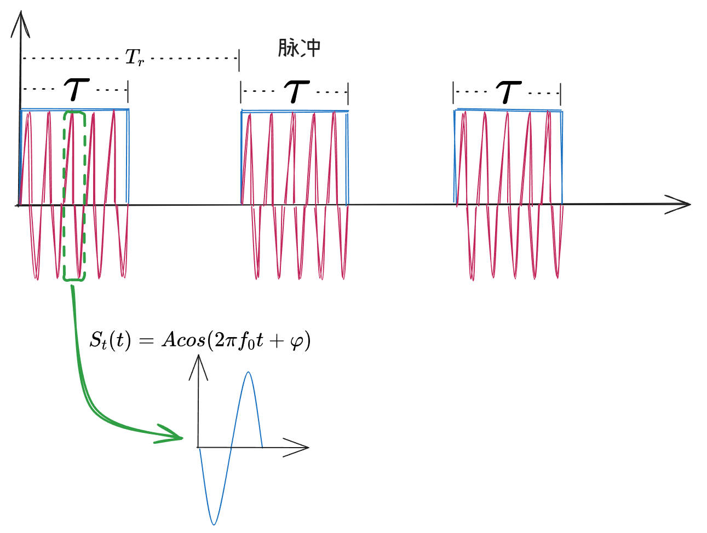
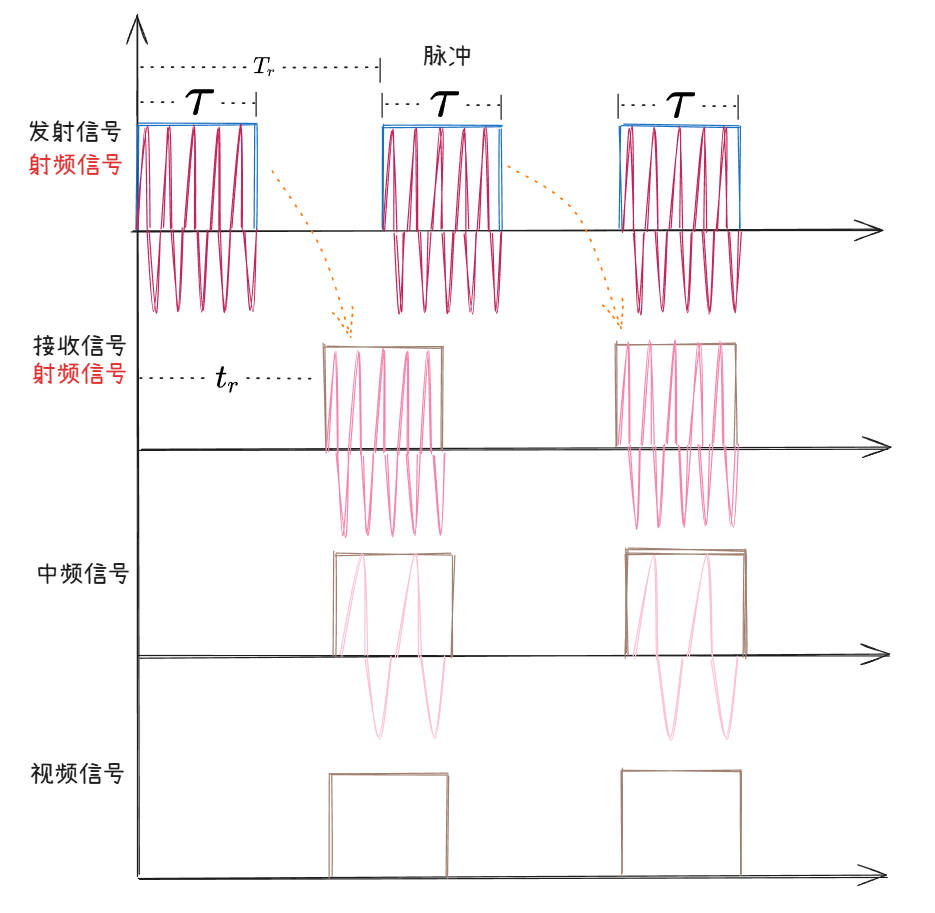
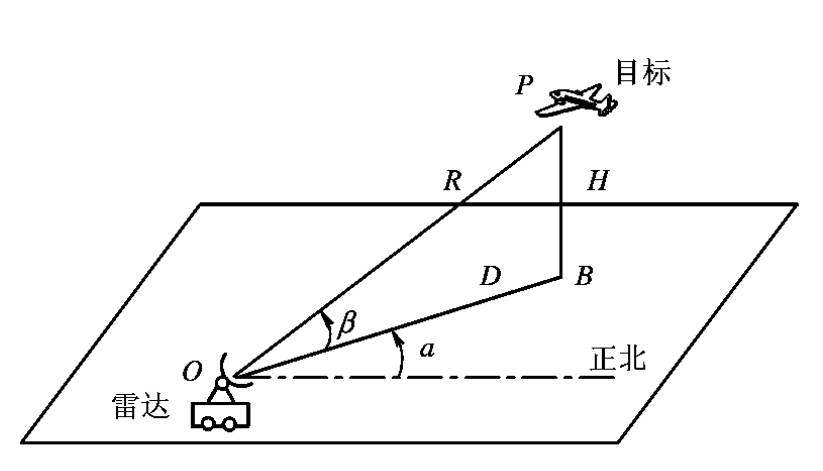
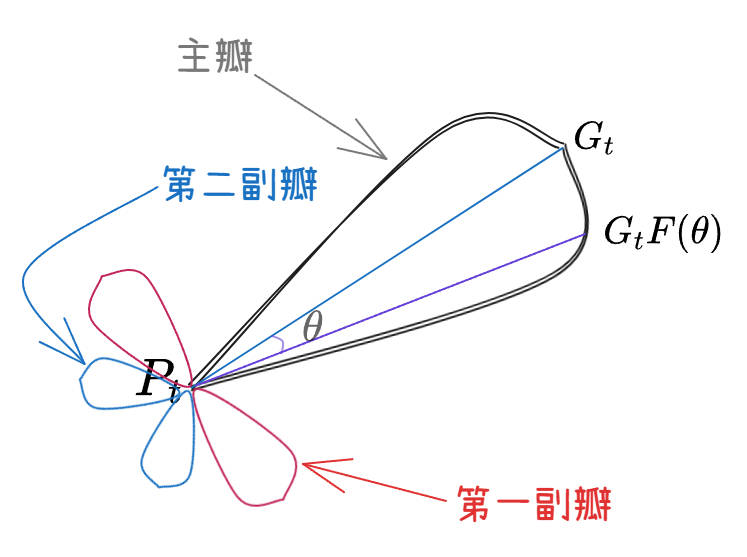

## **雷达组成部分**
---
雷达主要由以下部分组成

1. `天线`：发射信号、接收回波

2. `发射机`：产生射频信号

雷达发射的波为电磁波，发射的射频信号为余弦信号$S_t(t)=Acos(2\pi f_0 t + \varphi )$，其中$f_0$为载波频率,存在$\lambda f_0=c$关系。

雷达为节约能量通常不采用连续工作模式，通常采用脉冲方式进行工作，每个脉冲工作的时间为$\tau$（脉冲宽度），每个脉冲周期为$T_r$。

3. `接收机`：接收射频信号

    射频 --> 中频 --> 视频

    

4. `信号处理机`：提取目标信号信息

5. `终端显示设备`

6. `伺服系统`：同步设备

## **目标的参数测量**
---
### **坐标系**

球坐标（$R$,$\alpha$ [+方位角] $\beta$ [+俯仰角]）

[+方位角]:
    方位角

[+俯仰角]:
    俯仰角

### **距离测量**

$R=\dfrac{c}{2} t_r$

### **角度测量**

::: tip 条件
* 电磁波是直线传播

* 雷达天线具有方向性。!!雷达天线分为有方向和无方向性!!{.blur .hover}
:::

::: details 天线方向图

在雷达天线的主瓣内，某个方向偏离最大值方向越大，这个方向的增益越小。
:::

### **目标速度测量**

> [!IMPORTANT]
> 雷达测速是基于`多普勒效应` [+多普勒] 进行测速。

[+多普勒]:
  当雷达发射的电磁波遇到运动物体时，反射波的频率会因物体相对雷达的运动速度而发生偏移。
  **靠近雷达**运动：反射波频率升高;**远离雷达**运动：反射波频率降低。

多普勒频移$f_d$与目标速度的关系为：$v_r=\dfrac{f_d \cdot \lambda}{2}$，其中$f_d$为多普勒频率。

多普勒频率是将发射信号与接收信号混频，得到差频$f_d$。

::: tip 雷达测速要点
* 雷达测速测的是径向速度，只能测量目标沿雷达波束方向的速度分量。横向运动无法直接检测。若飞机绕着雷达做圆周运动，则雷达认为速度为0。

* 多普勒效应可以判断出目标是远离雷达还是靠近雷达运动。
:::

## **基本雷达方程**

基本雷达方程: 雷达最大作用距离方程

$$R_{max}=\left [ \frac{P_tG_tG_r\lambda ^2\sigma }{(4\pi)^3S_{min} }  \right ] ^\frac{1}{4} $$

## **雷达的工作频率**
---

| 频段名称  | 波长     | 
|----------|----------|
| $L$      |   22cm   |
| $S$      |   10cm   |
| $C$      |   5cm    |
| $X$      |   3cm    |
| $K_u$    |   2.2cm  |
| $K_a$    |   8cm    | 