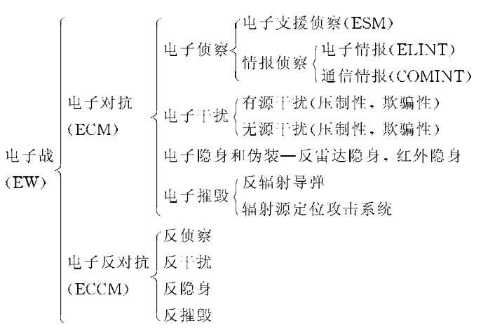

## **雷达的分类**
---

* 预警雷达

* 警戒雷达

* 引导指挥雷达

* 火控雷达

* 战场监视雷达

* 测高雷达

* 近炸引信

## **雷达的发展**
---

| 缩写 | 中文名               | 原理                                                                 | 应用场景                 |
|------|----------------------|----------------------------------------------------------------------|--------------------------|
| PC   | 脉冲压缩             | 发射宽脉冲信号并通过匹配滤波压缩，提高距离分辨率                     | 军用雷达、汽车毫米波雷达 |
| SAR  | 合成孔径雷达         | 利用雷达平台运动合成虚拟大孔径，实现二维高分辨率成像                 | 卫星遥感、地形测绘       |
| ISAR | 逆合成孔径雷达       | 利用目标自身运动产生的多普勒信息进行高分辨率成像                     | 飞机/舰船目标识别        |
| PD   | 脉冲多普勒           | 采用高脉冲重复频率序列和多普勒滤波，实现运动目标检测与精确测速       | 机载火控雷达、气象雷达   |

数字 --> 模拟

## **电子战示意图**
---

