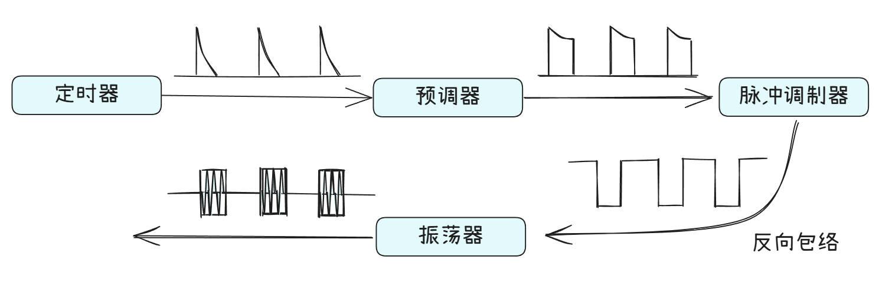
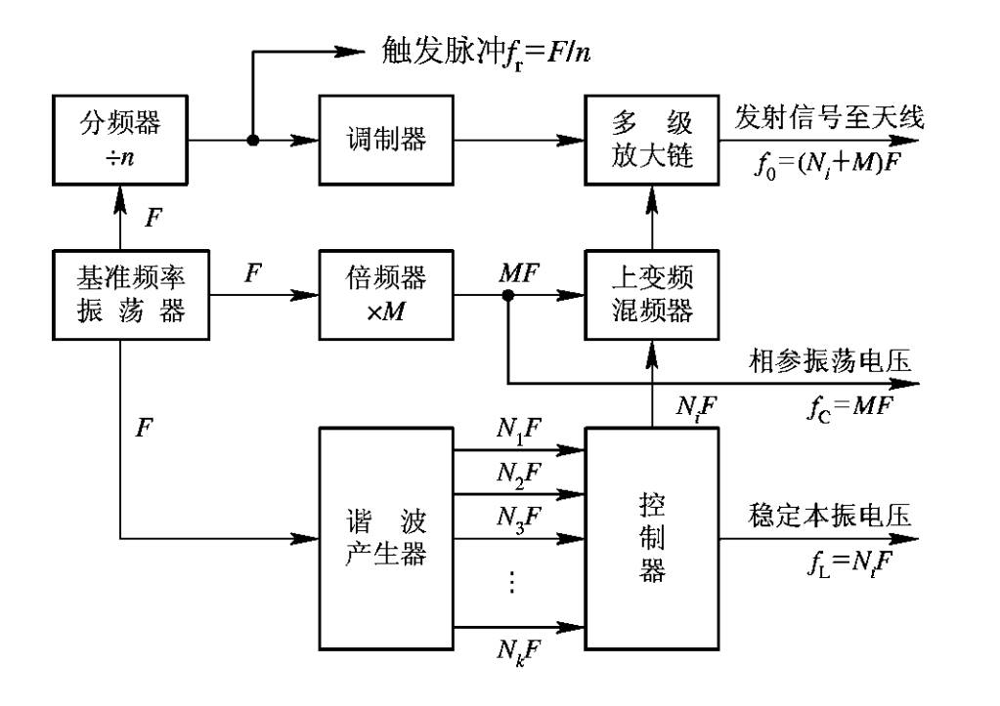

::: info 雷达发射机的任务

产生`大功率`、`特定调制`的射频信号。

:::

## **信号特定调制方法**
---

### **振幅调制**

* 连续波信号

`定义`：未调制的单一频率正弦波（如纯载波）。

`特点`：无信息承载能力，常用于雷达测速（通过多普勒频移）或通信中的导频信号。

* 脉冲信号

`定义`：周期性或非周期性的脉冲序列，通过脉冲的幅度或位置传递信息。

`应用`：雷达测距（脉冲延迟时间）、数字通信。

### **频率调制**

1. 固定频率

`定义`：载波频率恒定不变（如传统FM广播的瞬时频率）。

`特点`：简单，但抗干扰能力较弱。

2. 频率分级

`定义`：载波频率在多个预置频点间跳变（如蓝牙、军事通信）。

`优点`：抗干扰和抗截获能力强。

3. 频率编码

`定义`：用不同频率组合表示数字信息（如FSK的扩展）。

`示例`：多频移键控（MFSK）

4. 线性调频

`定义`：频率随时间线性变化（如雷达中的LFM信号）

5. 频率捷变

`定义`：雷达或通信中快速切换频率以对抗干扰。

`特点`：与频率分级类似，但更强调动态适应性。

### **相位调制**

1. 随机相位

`定义`：每个脉冲或符号的初始相位随机（如非相干通信）。

`目的`：降低信号相关性，减少干扰。

2. 相位相参

`定义`：信号间保持固定相位关系（如连续波雷达）。

`优点`：提高多普勒测量精度

::: tip 

如果雷达系统的发射信号、本振电压、相参振荡电压和定时器的触发脉冲均由同一基准信号提供，那么所有这些信号之间均持相位相参性，通常把这种系统称为全相参系统。

:::

3. 相位编码

`定义`：用离散相位变化表示信息

## **雷达发射机的组成**
--- 

### **单极震荡式**

::: note 关键点
大功率电磁振荡产生与调制同时完成。
:::

### **主振放大式式**

::: note 关键点
先产生小功率的连续波信号，再分多级进行调制和放大。
:::

特点：

1. 具有很高的频率稳定度

2. 发射相位相参信号

3. 适用于频率捷变雷达

4. 能产生复杂波形