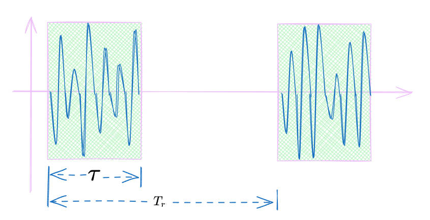
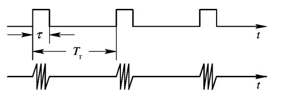
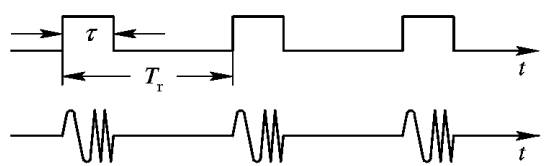
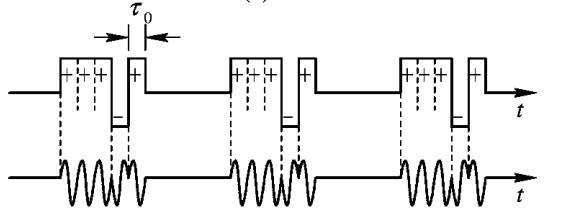
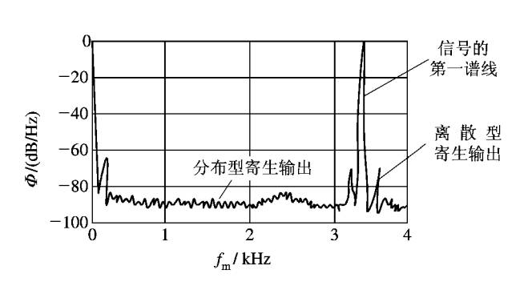

## **工作频率**
---
::: warning 雷达工作频率

雷达工作频率是指在射频的工作频率。

::: 
### **频率与器件有关**

雷达的工作频率主要由其核心射频器件决定，这些器件的物理特性限制了频率的选择范围。

| 频段 | 频率范围    | 关键器件               | 器件特性与挑战                          |
|------|------------|-----------------------|----------------------------------------|
| L/S  | 1-4 GHz    | 磁控管、大功率行波管    | 体积大、成本低，适合远程预警            |
| C    | 4-8 GHz    | GaN放大器、硅基TR组件   | 平衡功率与分辨率，相控阵常用            |
| X    | 8-12 GHz   | 固态振荡器、波导滤波器   | 高精度制导，天线尺寸适中                |
| Ku   | 12-18 GHz  | MMIC                  | 高频损耗增加，需集成化设计              |
| Ka   | 26.5-40 GHz| 砷化镓(GaAs)放大器      | 毫米波成像，功率效率下降(<30%)          |
| W    | 75-110 GHz | 氮化镓(GaN)HEMT器件     | 极高频率，依赖先进半导体工艺            |

### **频率与功率有关**

频率选择直接影响雷达的功率处理能力，进而决定探测距离与分辨率。

| 频段 | 典型功率水平       | 功率限制因素                 | 应用场景                     |
|------|------------------|----------------------------|----------------------------|
| L/S  | 兆瓦级(峰值)      | 大气衰减低，器件效率高(>50%) | 远程预警雷达、对地探测       |
| C/X  | 千瓦级(平均)      | 固态器件成熟，热管理可控      | 机载火控、气象雷达           |
| Ku/Ka| 百瓦级(连续波)    | 高频损耗大，效率下降(20-30%)  | 高分辨率SAR、卫星通信        |
| W    | 毫瓦级(集成阵列)  | 半导体物理限制               | 汽车雷达、安检成像           |

## **输出功率**
---

### **平均功率**
$P_{av}$：$T_r$内的输出平均功率。
### **峰值功率**
$P_{t}$：$\tau$内的输出平均功率。

::: note 平均功率与峰值功率之间的关系

$P_{av}=P_t \cdot \dfrac{\tau }{T_r} =P_t\cdot D$

D：工作比 

:::
## **总效率**

$$\eta =\frac{p_{av}}{P_s} $$
## **雷达信号形式**
---
| 波形               | 调制类型         | 工作比/%     |
|--------------------|------------------|-------------|
| 简单脉冲           | 矩形振幅调制     | 0.01~1      |
| 脉冲压缩           | 线性调频         | 0.1~10      |
|                   | 脉内相位编码     |            |
| 高工作比多卜勒        | 矩形调幅         | 30~50       |
|     调频连续波     | 线性调频         | 100         |
|                    | 正弦调频         |            |
|                    | 相位编码         |            |
| 连续波             |                 | 100         |

* 固定载频信号

    

* 脉冲压缩信号

    

* 相位编码信号

    

## **信号频率稳定度和纯度**
---

### **离散型的寄生谱**
主副瓣比：
$$10\lg\dfrac{\text{信号谱的最大功率}}{\text{寄生谱的最大功率}}$$

### **分布型寄生输出**
频谱纯度：
$$L(f_m)=10\lg\dfrac{\text{距主频}f_m\text{处单边带}\bigtriangleup B \text{内的功率}}{\bigtriangleup  B \times \text{信号功率}}$$