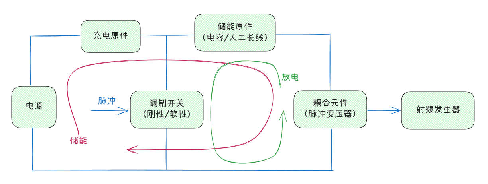
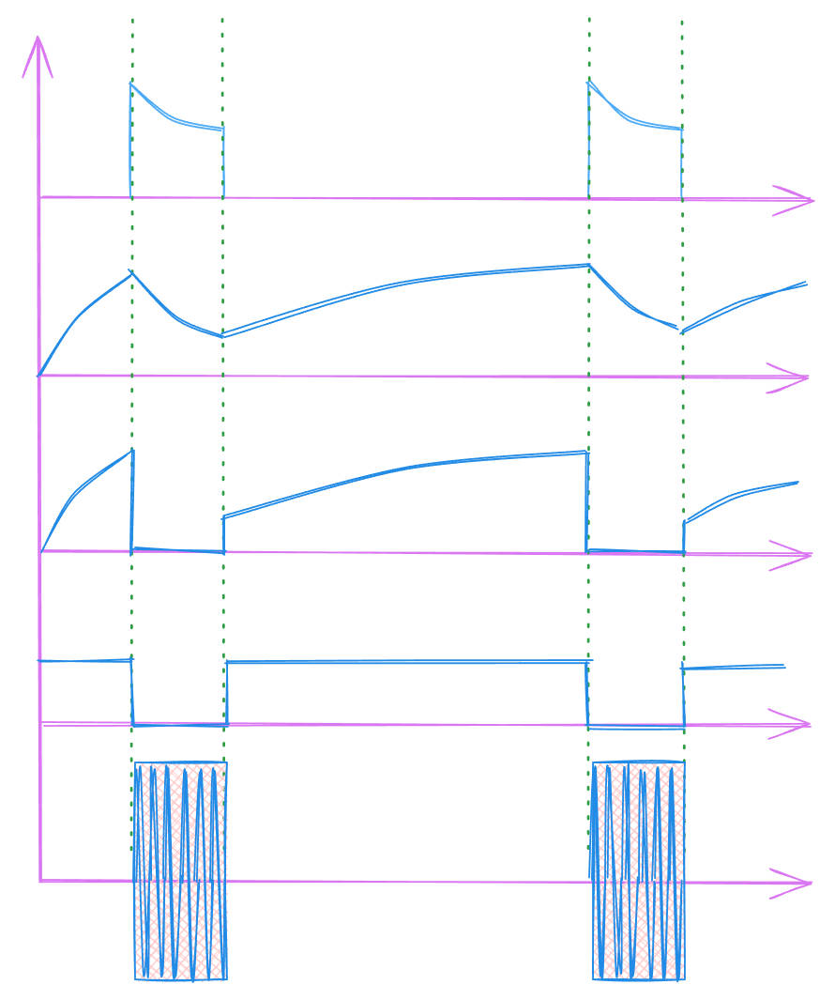
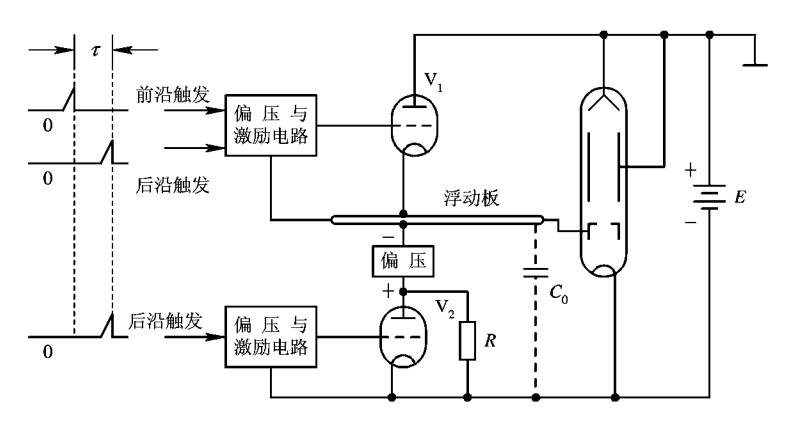
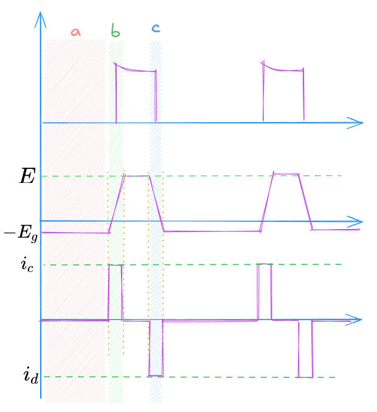
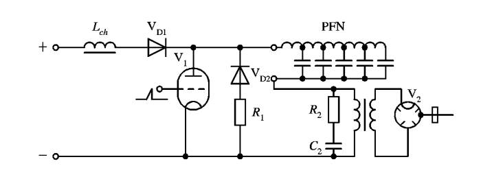

## **基本组成**

### **刚性开关脉冲调制器**

本质是一个视频脉冲放大器。充分考虑在大功率下运用，保证射频发生器的良好波形。

### **调制阳极脉冲调制器**

注：偏压为$E_g$

==工作原理=={.important}

a. `休止期`，$V_1$，$V_2$截止，负偏压给$C_0$充负压，充到$-E_g$。

b. 工作期`前沿到来`，$V_1$导通，$V_2$截止，恒流$i_c$。$C_0$电压线性上升到$E$为止。

$$C_0\frac{du_c}{dt} =i_c$$

$$u_c=\frac{i_c}{c_0}t-E_g$$

c. 工作期`后沿到来`，`V_1`截止，`V_2`导通。横流$i_d$

$$u_c=\frac{i_d}{c_0}t+E$$

==特点=={.warning}

1. 调制管上承担大功率

2. 适用于宽脉冲、高工作比的雷达

3. 顶部平坦、波形好。

### **软性开关脉冲调制器**

为了在负载上获得近于矩形的脉冲，储能元件用开路长线组成，根据开路长线向匹配负载放电的原理，在负载上可以形成宽度等于电磁波在长线上往返传播时问的矩形脉冲。

==工作原理=={.important}

`储能元件`：人工长线(PFN)

由于软性开关在控制其导通后只有通过它的电流下降到一定电平(接近于零)以后才能断开，因而储能元件只能是完全放电
为了在负载上获得近于矩形的脉冲，储能元件用开路长线组成，根据开路长线向匹配负载放电的原理，在负载上可以形成宽度等于电磁波在长线上往返传播时间的矩形脉冲。

为了提高充比效率，在软性开关调制器中广泛采用电感作为充电原件。通常设计得使充电回路的白然谐振周期$T_{ch}=2\pi \sqrt{L_{ch}C_0}$（$C_0$是仿真线的静电容）等于脉冲重复周期$T_r$的两倍，即$T_r=\pi \sqrt{L_{ch}C_0}$，这种充电方式成为直流谐振充电。在忽略充电电路损耗时，仿真线在充电结束时的电压为电源电压的两倍。

==特点=={.warning}

输出的前沿与要调制的脉冲前沿一样，后沿不一定一样。

开关控制脉冲的起始段，储能元件放电完毕后，脉冲自动结束。