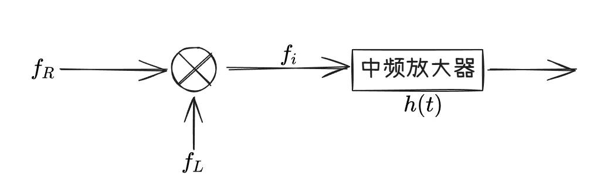

## **雷达接收机的任务**
---
::: tip 任务
不失真的放大`所需的微弱信号`，抑制不需要的其他信号。
:::

其他信号:

1. 噪声 （noise）

2. 干扰 （jamming）

3. 杂波 （clutter）

发现概率：$P_d$

虚警概率：$P_{fa}$
## **超外差雷达接收机的组成**
---

### **高频部分**

1. $T/R$ [+收发转换开关]及接收机保护器

[+收发转换开关]:
    收发转换开关

2. 低噪声高频高增益放大器

3. 混频器、本振实现下变换

### **中频部分**

中频放大器起到了匹配滤波器的作用。

经过中频放大器后信号的信噪比增加。

### **AGC** [+AGC]

[+AGC]:
    AGC（Automatic Gain Control，自动增益控制）是一种通过动态调整系统增益来维持输出信号幅度稳定的技术，广泛应用于通信、雷达、音频处理等领域。其核心目标是**在输入信号幅度波动时，保持输出信号幅度相对恒定，从而避免信号失真或噪声放大**。

### **视频部分**

