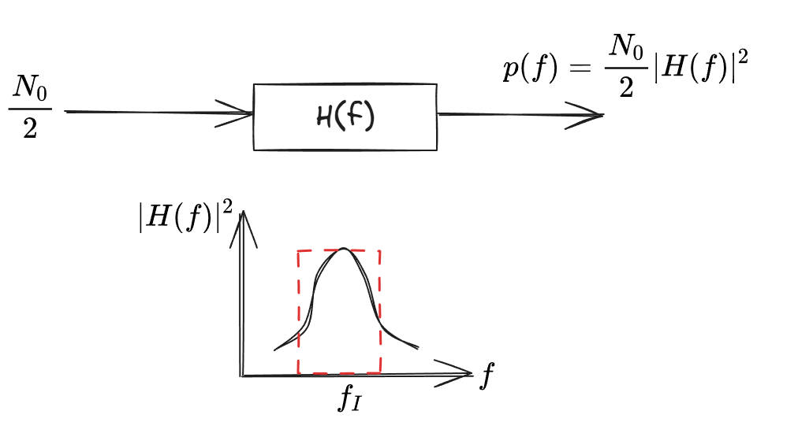

## **主要质量指标**

### **雷达接收机灵敏度**

$S_{imin}=S_i|_{\begin{matrix}  P_{fa}\\ P_{d}&\end{matrix}}$

正常接收机灵敏度：$-120\sim-140 dBW$

* $S_{imin}$：雷达接收机的最小可检测信号功率（灵敏度），即雷达能够可靠检测到目标所需的最低信号电平。
* $S_i$：接收机输入端的信号功率。
* $P_{fa}$：虚警概率，即噪声被误判为信号的概率。
* $P_{d}$：即正确检测到真实信号的概率。

接收机灵敏度计算公式：

$$S_{min}=kT_0BFM$$

* $k$：玻尔兹曼常数($1.38 \times 10^{-23}J/K$)
* $T_0$：标准噪声温度($290K$)
* $B$：接收机带宽($Hz$)
* $F_n$：接收机噪声系数
* $M$：检测所需的最小信噪比($(\frac{S}{N})_{omin}$)

::: note 

接收机灵敏度是告诉了接收机的最小输入信号。

:::

#### **工作带宽**

接收机的带宽。

### **动态范围**

::: note 
动态范围是接收机的最小输入信号与最大输入信号的比值。
:::

$D=10lg(\dfrac{S_{imax}}{S_{imin}})$

### **中频选择和滤波特性**

### **工作稳定性和频率稳定度**

## **接收机的噪声系数和灵敏度**

### **接收机的噪声**

1. 噪声来源

|         | 电阻热噪声 | 天线噪声|
|---------|-----------|---------|
|  普性质  |高斯 [^高斯]白噪声 [^白] |高斯色噪声 [^色]|
|噪声电压均方值|$\overline{u_n^2} =4kTBR$ [^噪声电压均方值]|$\overline{u_n^2} =4kTBR$ |
 
[^高斯]:
    高斯：指其幅度的概率分布符合正态分布。
[^白]:
    白噪声：表示功率谱密度在所有频率上均匀分布。
[^色]:
    色噪声：表示噪声能量集中在某些频段（非平坦频谱）。
    
[^噪声电压均方值]:
    $\overline{u_n^2}$:热噪声电压的 均方值（单位：$V^2$），即噪声电压的功率。

    $k$:玻尔兹曼常数（$\approx 1.38×10^{ −23} J/K$）

    $T$:电阻的 绝对温度（单位：K，通常取 290K 作为标准室温）。

    $B$:系统的 噪声带宽（单位：Hz）。

    $Rs$:电阻的阻值（单位：Ω）。

2. 定量描述  <Badge text="等效噪声功率谱宽度或噪声带宽" type="tip" vertical="top" />

功率谱密度3分位点 [^3分贝]计算方法：

在功率谱密度上找到3分位点，当$|H(f)|^2$时，对应功率降至峰值0.5，当$|H(f)|$时,对应幅度降至峰值0.707。

[^3分贝]:
    3分贝点（通常写作 -3dB点），功率衰减3dB，幅度衰减3dB。是信号处理中描述能量或幅度衰减至峰值一半（或幅度衰减至峰值的70.7%）的关键频率点。
    
    $10log_{10}(0.5)\approx -dB$

    $20log_{10}(0.707)\approx -dB$
