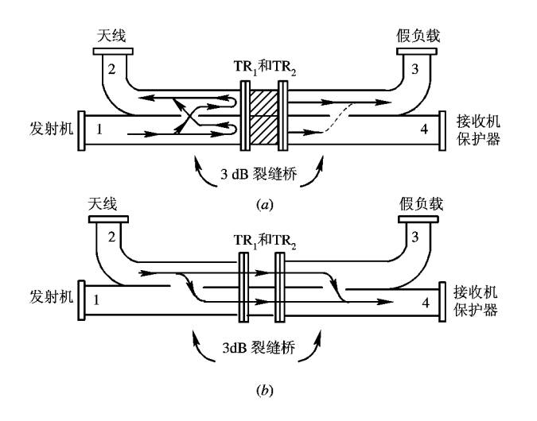

## **高频部分的组成**

* 收发转换开关
* 接收机保护器
* 低噪声高频高增益放大器
* 混频器
* 本振

## **平衡式收发转换开关**

### **作用**

当雷达处于接收状态时，收发转换开关将天线与接收机连通，和发射机断开；当雷达处于发射状态时，收发转换开关将天线与接收机断开，和发射机连通。

当信号渗漏时，会导致接收机或发射机过载烧毁。

::: tip 什么时候需要收发转换开关

只有当雷达天线共用时才需要收发转换开关。

若雷达的发射机和接收机拥有独立天线时，则不需要收发转换开关。

:::

### **工作原理**

::: tip 假负载的作用

假负载用于消耗能量，通常采用大阻值电阻。

:::

::: note 3dB裂缝桥的作用 

将信号的相位滞后$\dfrac{\pi}{2}$

:::

==发射状态分析过程==

1. 发射状态时，$TR_1$，$TR_2$放电大部分能量反射。

2. 假设发射机发射的信号为$e^{j\omega t}$。

3. 接收机接收到的信号为0。

==接收状态分析过程==

1. 接收状态，$TR_1$，$TR_2$不放电，天线接收的信号在接收机处同向相加。

2. 假设天线接收到的信号为$e^{j\omega t}$

3. 接收机接收到的信号为全部信号，假负载不消耗信号能量。

## **低噪声高频高增益放大器**

## **混频器**

### **混频器的作用**

本振和射频相混频取得的频率差是中频信号。

### **混频器示意图**

混频器的的输出是两个输入信号的谐波分量。

超外差雷达期望得到的输出是$f_i=f_L-f_R$。

### **混频器的重要指标**

如何消除和抑制寄生信号 [+寄生信号的来源]。

[+寄生信号的来源]:
    混频器是非线性的。

