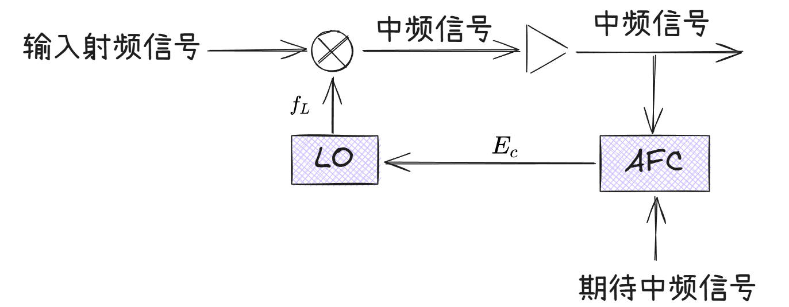

## **本振**

对于本振信号，信号稳定性越高越好，信号的带宽越窄越好。

::: note 本振的作用

产生一个与射频信号相对稳定的信号。
:::

## **常规雷达本振与AFC [+AFC]**

::: info 特点
常规雷达本振是随着输入的射频信号进行变化的。
:::

[+AFC]:
    自动频率控制

注：LO为本地振荡器

==鉴频器==

鉴频器（Frequency Discriminator） 的核心任务是从调频（FM）信号中还原出原始的控制信号（即调制信号）。

输入：一个频率随调制信号变化的调频波（FM Wave）。其频率在中心频率 $f_c$附近上下波动，波动的大小由调制信号的幅度决定，波动的快慢由调制信号的频率决定。

输出：一个电压随输入信号频率变化而变化的信号，这个输出电压的变化规律正好与原始的调制信号一致。

简单比喻：它是一个“频率-电压转换器”。就像是一个转速表，测量发动机的转速（频率）并转换成指针的偏转角度（电压）。

## **现代雷达本振与AFC**

::: info 特点
现代雷达本振是固定的，调谐发射区跟踪本振信号。
:::

::: tip AFC的目的

使输出的信号频率动态稳定在期望频率上。

:::