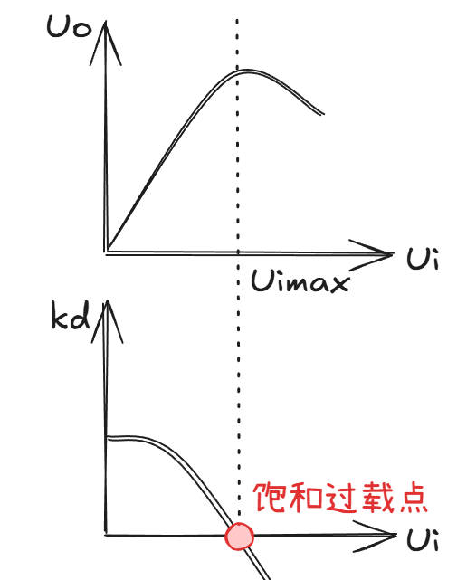
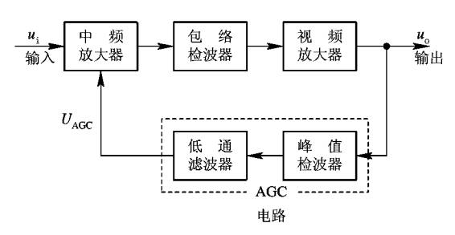
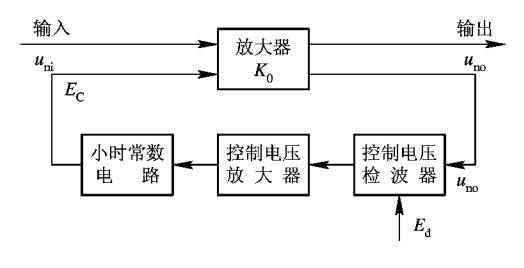

## **接收机的动态范围**

### **定义**
从功率角度：
$10lg\dfrac{P_{imax}}{P_{imin}}=D(db)$

从电压角度：
$20lg\dfrac{U_{imax}}{U_{imin}}=D(db)$

### **饱和过载**

增量增益：$K_d=\dfrac{du_o}{du_i}$

若$k_d\le0$表示过载。

## **增益控制**

### **自动增益控制AGC**

==反馈机制==

AGC通过闭环反馈调整接收机增益。首先检测输出信号的平均功率（如对数放大后或检波后信号），与预设参考电平比较，生成误差信号控制可变增益放大器（VGA）。

### **瞬时自动增益控制IAGC**

==前馈机制==

实时监测输入信号功率（通常在射频或中频段），直接控制增益而无反馈延迟。利用快速峰值检测电路或数字采样（如FPGA实时处理）。

### **时间灵敏度控制（TSC）电路**

在雷达刚刚工作时需要使用。在快速变化的信号（如突发干扰、近距离目标）和慢变信号（如远距离目标、背景噪声）之间取得最佳处理效果。

$P_{im}=KR^{-\alpha }$ ，其中$\alpha = 2.7 \sim 4.7$