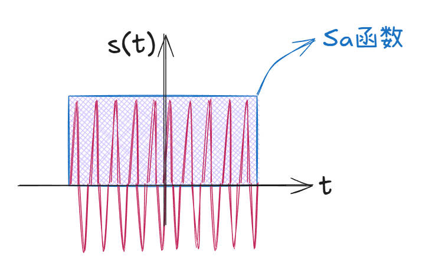
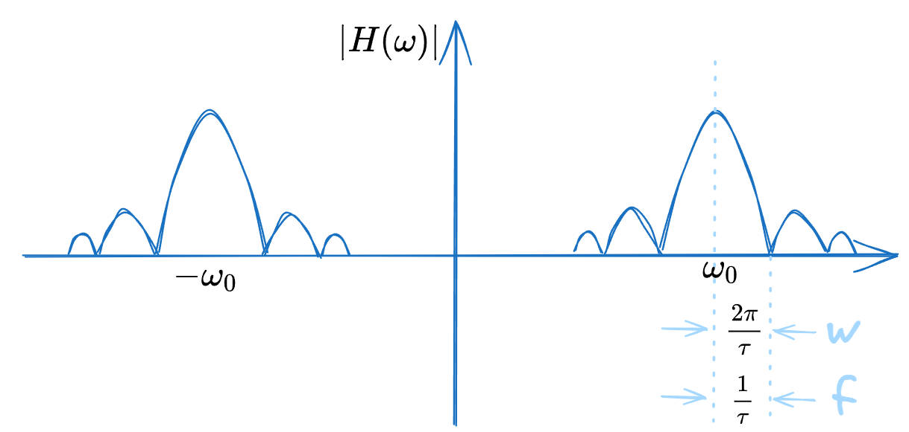
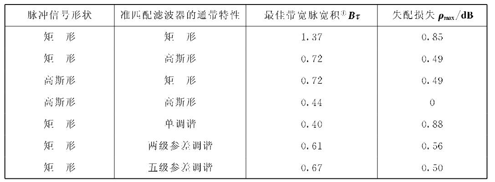

## **带宽示意图**

$B_R=B_I$

## **中频放大器**

::: tip 
中频放大器又称匹配滤波器。
:::

::: note 匹配滤波器概述

匹配滤波器（Matched Filter）是信号处理中的一种最优`线性滤波器`，主要用于在含有噪声的信号中检测已知形状的信号（即“模板信号”）。它的核心思想是通过`最大化输出信噪比`（SNR）来提升信号的检测性能。

::: 

==目标==

在噪声背景下检测已知信号（如雷达回波、通信中的脉冲信号等）。

==核心思想==

设计一个滤波器，其冲激响应与目标信号共轭镜像匹配，使得信号通过滤波器后输出信噪比达到最大。

==数学推导==

1. 已知信号$s(t)$，持续时间为$0\le t \le T$

2. 噪声为高斯白噪声，功率谱密度为$\dfrac{N_0}{2}$

3. 匹配滤波器`时域`数学表达式（冲激响应函数）：

    $h(t)=ks^*(t_0-t)$

    匹配滤波器`频域`数学表达式（传递响应函数）：
    
    $H(f)=kS^*(f)e^{-j2\pi ft}$ 
    
    $H(\omega )=|H(\omega )|e^{j\varphi  (\omega )}$

    其中$k$为常数；$s^*$为共轭；$T$为结束时间（保证因果性）

    ::: note 

    $|H(\omega)|$反应幅频特性；$\varphi  (\omega )$反应相频特性

    一个信号能否通过滤波器，关心的是幅频特性。

    :::

4. 匹配滤波器的最大输出信噪比公式为：
$$(\frac{S}{N})_{omax}=\frac{2E}{N_0}$$

::: tip $t_0$的含义

当在$t_0$时，接收机能够获得最大信噪比。

:::

## **单个脉冲信号的匹配滤波**

假设信号为:

$$s(t)=\left\{\begin{matrix}Acos\omega _0 t  & |t|\le \frac{\tau }{2}  \\0  &  \text{其他}\end{matrix}\right.$$

对应的包络信号信号（门信号）:

$$rect(x)=\begin{cases} 1, & |t| \leq \frac{T}{2} \\0, & |t| > \frac{T}{2}\end{cases}$$

对应的`傅里叶变换`为：$Sa(x)$函数 [+别名] ：

$$Sa(x)=\dfrac{sin(x)}{x}$$

[+别名]:
    $sinc(x)$函数、辛克函数

$s(t)$的傅里叶变换为：
$$S(\omega) = \frac{A\tau}{2} \left[ \text{sinc}\left( \frac{(\omega - \omega_0)\tau}{2} \right) + \text{sinc}\left( \frac{(\omega + \omega_0)\tau}{2} \right) \right]$$

只关心$sinc(x)$的幅度值，对应图像为：

存在$B \tau \approx 1$ 关系。

::: note $B \tau$具体值

$B \tau$具体的数值与脉冲信号形状和准匹配滤波器的带通特性有关，具体值参考准匹配滤波器的参数表。

:::

## **准匹配滤波器**

失配损失：$\rho =\dfrac{(\frac{S}{N})_{\approx max}    }{\frac{2E}{N_0} }$

各种准匹配滤波器参数：

::: warning 接收机的噪声系数计算

$S_{imin}=kT_0BFM$

$B=B_{opt}+2\bigtriangleup f_\varepsilon$

:::

## **接收机带宽的选择**

### **警戒雷达**

$B_{RI}=B_{opt}+2\bigtriangleup f_\varepsilon$

其中，$f_\varepsilon$为剩余失谐。

::: tip 
为了追求最大`信噪比`。
:::

### **跟踪雷达**

::: tip 
为了追求`高精度`，采用较大的接收机带宽。
:::

$B_0=\dfrac{2 \sim 5}{\tau}$