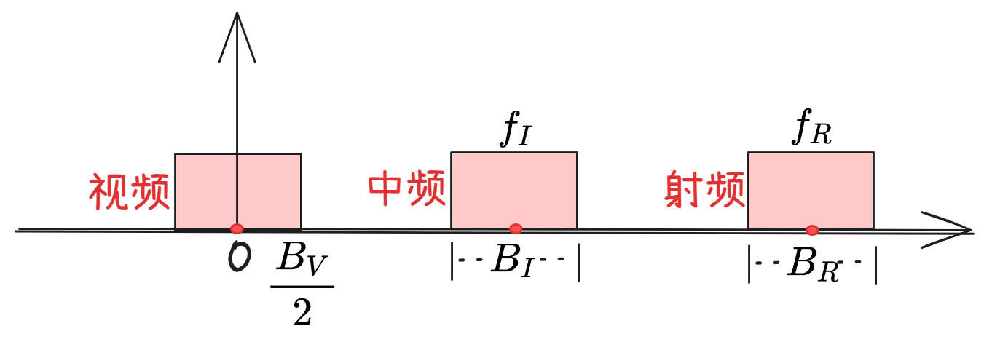
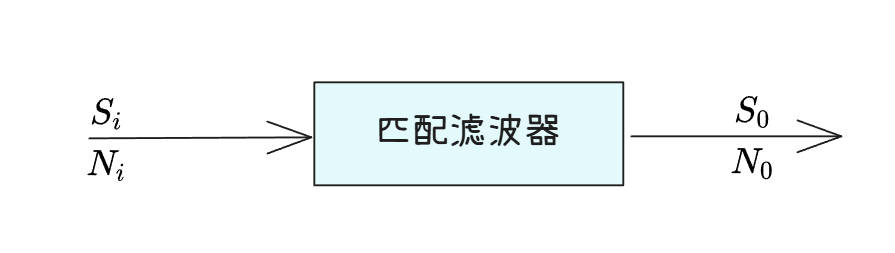

## **带宽示意图**

## **中频放大器**

::: tip 
中频放大器又称匹配滤波器。
:::

匹配滤波器是接收信号与发射信号进行匹配。

匹配滤波器`时域`数学表达式（冲激响应函数）：$h(t)=ks^*(t_0-t)$

匹配滤波器`频域`数学表达式（传递响应函数）：$H(f)=kS^*(f)e^{-j2\pi ft}$

匹配滤波器的最大输出信噪比公式为：
$$(\frac{S}{N})_{omax}=\frac{2E}{N_0}$$

## **单个脉冲信号的匹配滤波**