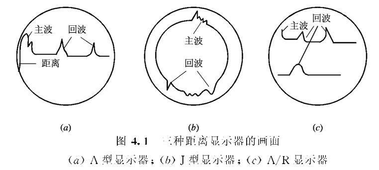
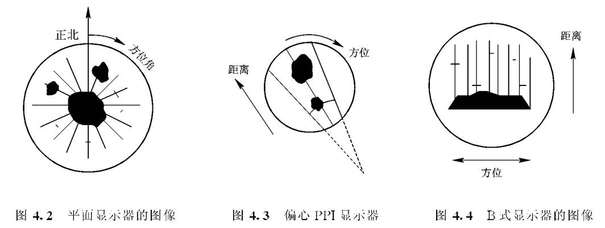
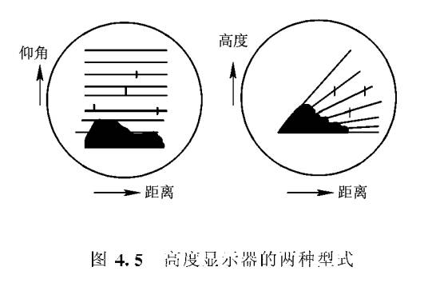
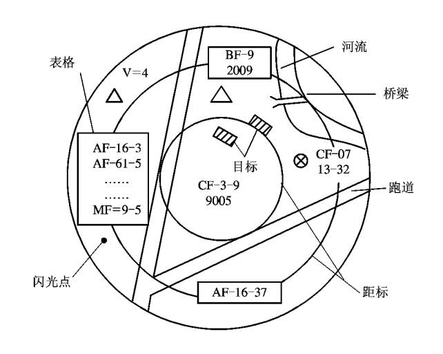

## **雷达终端显示器**

### **距离显示器**

1. 距离显示器显示的斜距坐标。

2. 通过振幅表示回波目标强弱

3. 一维显示器

### **平面显示**

1. 二维显示器

2. 亮度调制显示器

### **高度显示器**

### **情况显示器**

## **对显示器的要求**

1. 根据任务选择类型

2. 参数选择

3. 对比度

4. 重显频率
