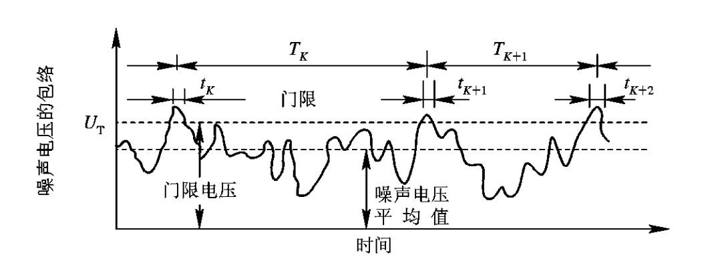
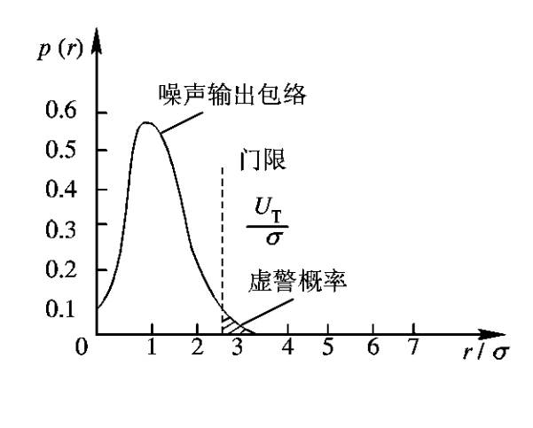
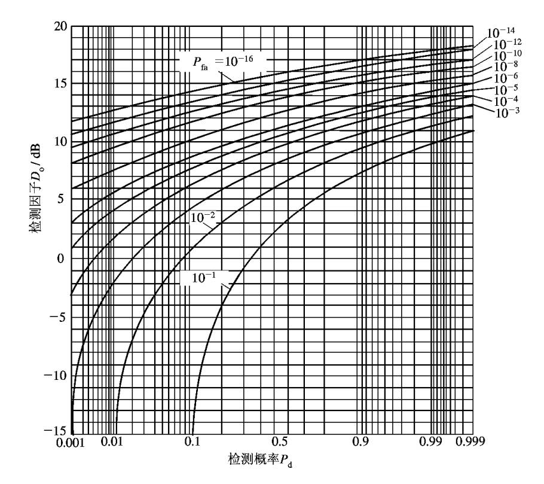

## **最小可检测信号与信噪比**

$$S_{imin}=kT_0BFM$$

$M=(\dfrac{S}{N})_{omin}$；识别系数

### **门限检测**

奈曼-皮尔逊准则，给定$\dfrac{S}{N}$，$P_{f_a}$，要求$Pd$最大。

检测门限：$V_T$

1. 无目标

* $V\ge V_T$ 判为有目标 虚警$P_{fa}$

* $V < V_T$ 判断为无目标 正确不发现$P_{an}=1-P_{fa}$
2. 有目标

* $V\ge V_T$ 判为有目标 正确发现$P_{d}$

* $V < V_T$ 判断为无目标 漏报$P_{\iota a}=1-P_{d}$

## **检测性能和信噪比**

### **虚警概率**

$$P_{fa}=e^{-\frac{V_T^2}{2\sigma ^2} }$$

虚警宽度：$t_k=\dfrac{1}{B}$

虚警时间：$T_{fa}$

虚警概率：$P_{fa}=\dfrac{t_k}{T_{fa}}$

虚警数：$n_f=\dfrac{1}{P_{fa}}$

### **发现概率**

在雷达信号检测理论中，检测因子是指在给定检测概率和虚警概率条件下，系统所需的最小信噪比（SNR）。这一过程通常通过查表法实现。

通过查表，根据检测概率和虚警概率找到对应的检测因子，检测引子为信噪比。

::: note
不能通过降低检测概率和虚警概率的指标来调整系统所需最小信噪比。可以通过脉冲积累的方法实现。

脉冲积累通过合并多个脉冲的回波能量，提升有效信噪比。
:::