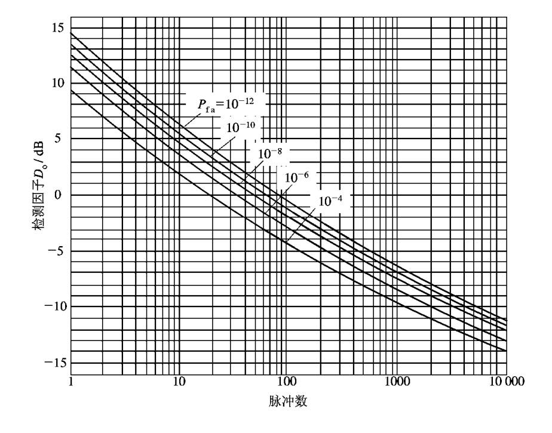
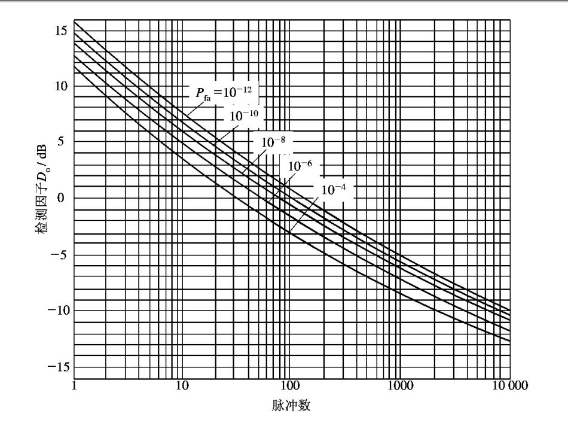

## **积累效果**

### **相参积累**

脉冲积累个数：$M=\frac{\theta _0\cdot s}{\omega } f_r$

一个脉冲所需的信噪比：$D_0(M)=\dfrac{D_0(1)}{M}$，$D_0(1)$由图标查找获得

经过相干积累，最大探测距离变大为：$R'_{max}=R_{max}\sqrt[4]{M}$

### **非相参积累**

$P_d=0.5$：

$P_d=0.9$：

只能通过查表获取。

## **脉冲积累数的确定**

当雷达天线扫描时，可积累的脉冲数（收到的回波脉冲数）取决于天线波束的扫描速度以及平面上天线波束的宽度。

接收到的脉冲数$N$：

$$N=\dfrac{\theta _{\alpha 0.5}f_r}{\Omega _\alpha cos\theta _e} =\dfrac{\theta _{\alpha 0.5}f_r}{6\omega _m cos\theta _e}$$

* $\theta _{\alpha 0.5}$：半功率天线方位波束宽度。
* $\Omega _\alpha$：天线方位扫描速度
* $\omega _m$：天线方位扫描速度
* $f_r$：雷达脉冲重复频率
* $\theta _e$：目标仰角