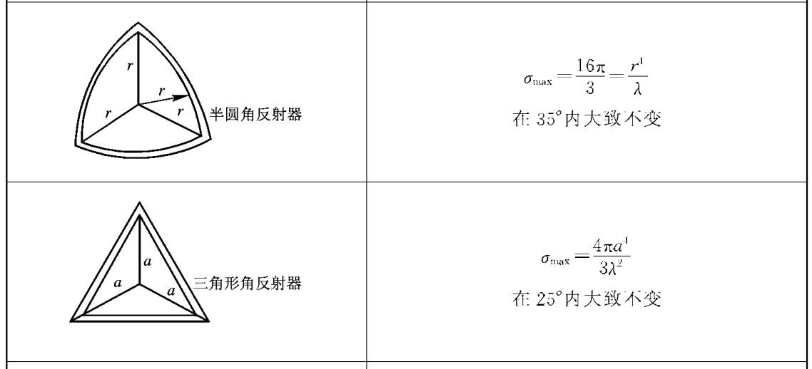
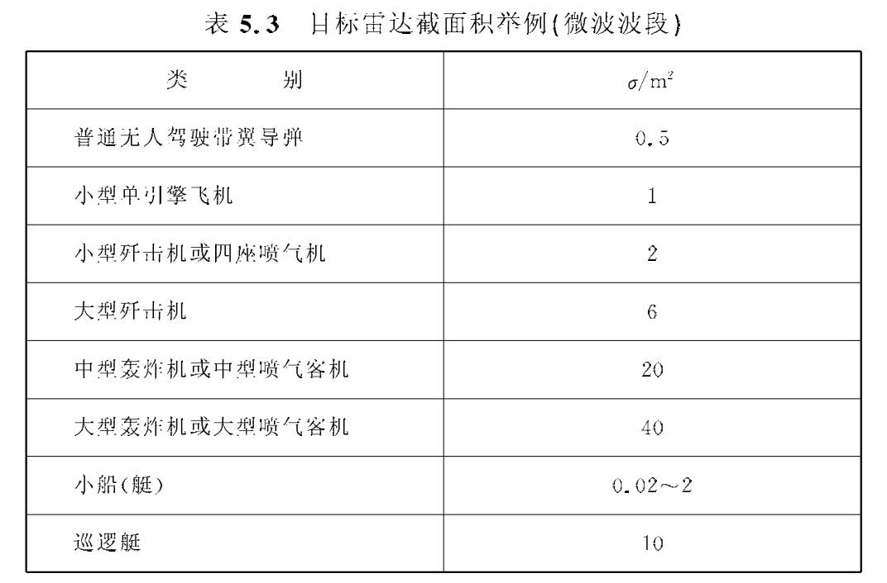
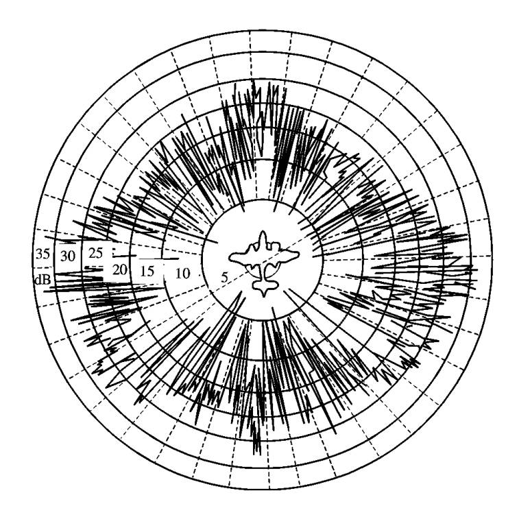
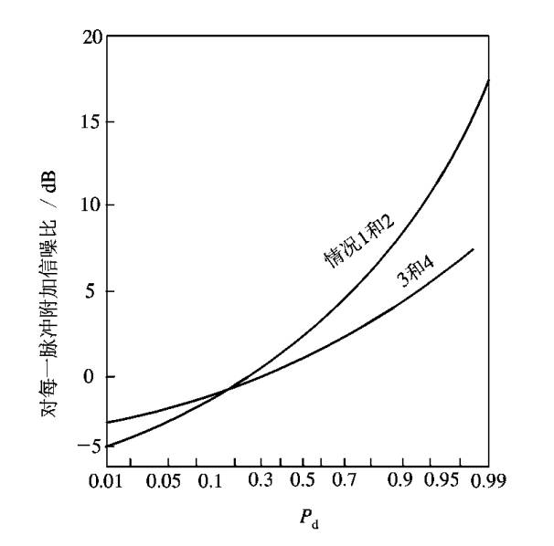

## **点目标特征与波长的关系**

脉冲雷达有三维分辨单元，此单元就是瞬时照射并散射的体积$V$：

### **简单形状目标的雷达截面积**

### **复杂目标的雷达截面积**

复杂目标的雷达截面积（RCS）会随观测角度和工作频率的微小变化而剧烈波动，因此在实际应用中需要采用单值表示方法来进行系统设计和性能估算。常用的方法包括平均值、中值、最小值（如95%时间超过的值）或通过实测反推RCS。例如，典型战斗机在微波波段的RCS平均值约为3~6平方米，但隐身设计的机型可能低至0.01平方米。由于RCS的强起伏特性，工程上需根据具体需求（如预警、火控或对抗隐身目标）选择合适的统计值，并结合多频段、多视角数据或动态修正技术来提高探测可靠性。

### **目标反射特性与极化的关系**

1. 线极化

照射电场分解为$E_H^T$，$E_V^T$；接收电场分解为$E_H^R$，$E_V^R$。

$$\begin{bmatrix}E_H^R \\E_V^R\end{bmatrix}=\begin{bmatrix} \alpha _{HH} &  \alpha _{VH} \\ \alpha _{HV}  &  \alpha _{VV}\end{bmatrix}\begin{bmatrix} E_H^T\\E_V^T\end{bmatrix}$$

$\begin{bmatrix}
 \alpha _{HH} &  \alpha _{VH} \\
 \alpha _{HV}  &  \alpha _{VV}
\end{bmatrix}$为散射矩阵

==特殊形体目标的散射矩阵==

* 各项同性的球体

$$\begin{bmatrix} \alpha  & 0\\ 0 & \alpha \end{bmatrix}$$

* 入射方向对称物体

$$\begin{bmatrix} \alpha_{HH}  & 0\\ 0 & \alpha_{VV} \end{bmatrix}$$

2. 圆极化

$$\begin{bmatrix}E_R^S \\E_L^S\end{bmatrix}=\begin{bmatrix} \alpha _{RR} &  \alpha _{LR} \\ \alpha _{RL}  &  \alpha _{LL}\end{bmatrix}\begin{bmatrix} E_R^T\\E_L^T\end{bmatrix}$$

当发射和接收天线采用相同极化的圆极化天线时，对于近似球形的目标（如雨滴等气象微粒），由于回波信号的极化方向会发生反转，接收功率会显著减弱甚至为零。这一特性可被用于气象雷达中，通过采用同极化的圆极化天线来有效滤除雨滴等球形干扰目标的回波，从而突出飞机等非对称目标的信号。这种极化滤波方法能够提高雷达在复杂气象条件下的目标检测能力。

## **目标的起伏方程**

| 模型  | 分布特性                                                                   | 相关性 |
|-----|------------------------------------------------------------------------|-----|
| I   | $\frac{1}{\bar{\sigma } } e^{-\frac{\sigma }{2\bar{\sigma }} }$        | 慢起伏 |
| II  | $\frac{1}{\bar{\sigma } } e^{-\frac{\sigma }{2\bar{\sigma }} }$        | 快起伏 |
| III | $\frac{4\sigma }{\bar{\sigma }^2 } e^{-\frac{2\sigma }{\bar{\sigma}}}$ | 慢起伏 |
| IV  | $\frac{4\sigma }{\bar{\sigma }^2 } e^{-\frac{2\sigma }{\bar{\sigma}}}$ | 快起伏 |
| V   |                                                                        | 不起伏 |

### **目标起伏与检测性能影响**

由于目标起伏，引起检测困难，$D_0$增加。

