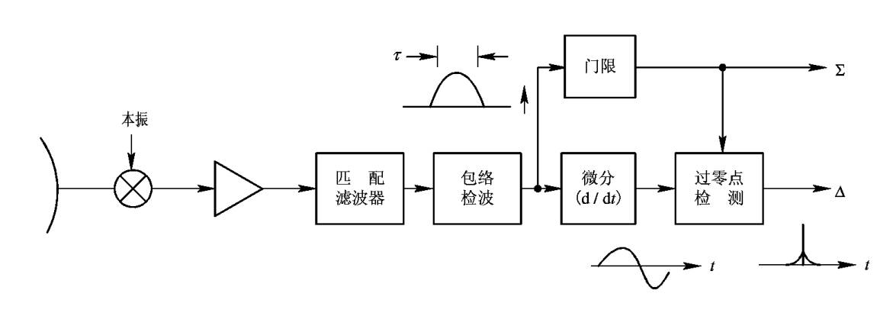
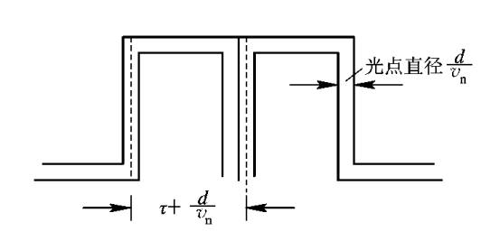
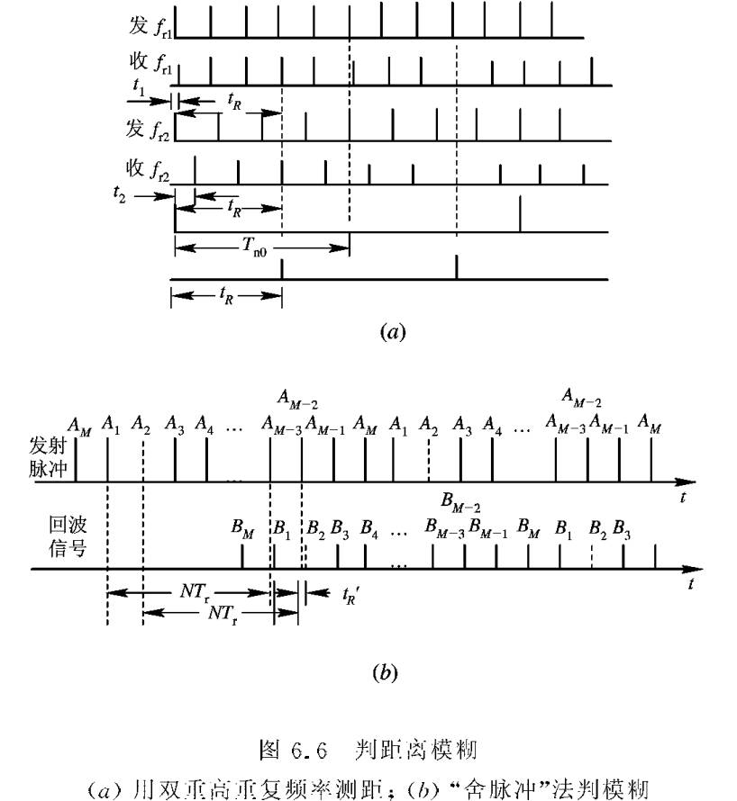

## **基本原理**

由于回波信号的前沿往往存在斜坡、振荡或噪声干扰，难以精确确定其起始时刻，因此采用发射信号和回波信号的中心点（如峰值或能量对称点）作为时间基准。这种方法利用信号中心位置受畸变影响小、稳定性高的特点，通过计算两中心点的时间差来测量传播延迟，从而提高测距精度，尤其适用于前沿不理想或信噪比较低的场景。

### **回波脉冲中心测量方法**

### **影响测距精度的因素**

测量误差为：

$$dR=\frac{\partial R}{\partial c}dc+\frac{\partial R}{\partial t_R}  d_{t_R}=\frac{R}{c} dc+\frac{c}{2}d_{t_R}$$

* 时间差的影响

* 速度变化的影响

* 大气折射的影响

* 测读方法的误差

## **距离分辨率和测距范围**

### **距离分辨率示意图**

定义距离分辨率为$\bigtriangleup R_c$：$\bigtriangleup R_c=\dfrac{c}{2} (\tau +\dfrac{d}{v_n} )$

* $d$为光点直径；
* $v_n$为光点扫掠速度

### **最小测距范围**
$R_{min}=\frac{1}{2}c(\tau+t_0)$

$t_0$：收发开关

$R_{max}=\frac{1}{2}cT_r$

$M=\frac{\theta_{0.5}}{\omega} \cdot \frac{1}{T_r}$

$R=\frac{1}{2}ct_R=\frac{1}{2}c(mT_r+t_r)$

## **最大无模糊测距范围**

* 最小测距范围：$R_{min}=\frac{1}{2}c(\tau+t_0)$

    $t_0$为收发转换开关转换时间

* 距离模糊的判决方法

    