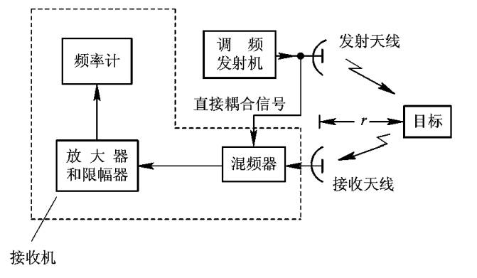
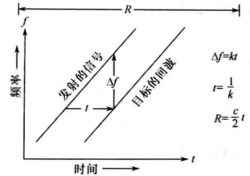
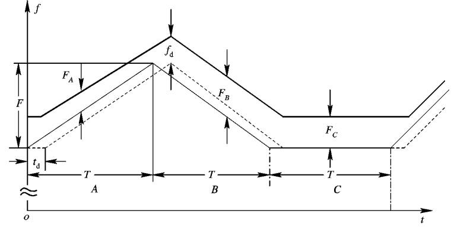

## **基本组成**

## **调频连续波测距原理**

::: note 原理 
利用频率差进行测距。
:::

## **三角波调频连续波测距**

$F_A=f_d-\mu t_d=\frac{2v_r}{\lambda }-\mu \frac{2R}{c}$

$F_B=f_d+\mu t_d=\frac{2v_r}{\lambda }+\mu \frac{2R}{c}$

$F_c=f_d=\frac{2v_r}{\lambda }$

$F_B-F_A=4\mu \frac{R}{c}$

$R=\frac{F_B-F_A}{4\mu } c$

$v_r=\frac{\lambda Fc}{2}$

::: note
选择较大的T，保证测距的单值性。
:::