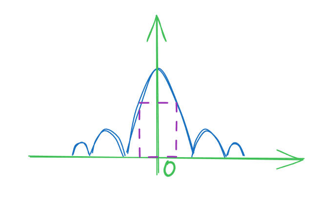
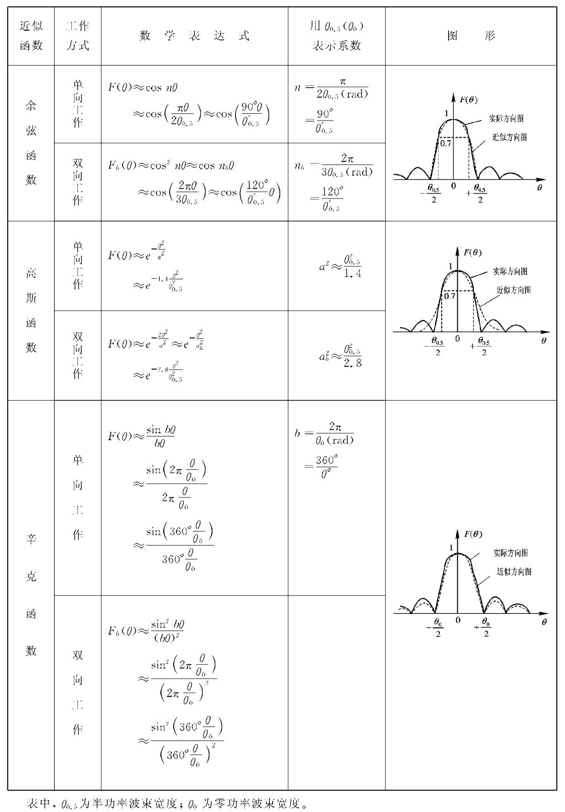

## **角度测量的方法**

1. 振幅法测向

2. 相位法测向

## **天线方向图**

天线方向图函数：$F(\theta )=|F(\theta )|e^{j\varphi (\theta )}$

$|F(\theta )|$：振幅相应

$e^{j\varphi (\theta )}$：相位相应

由于通常只考虑振幅相应，使用$F(\theta )$表示天线方向图函数。

* $F(0) > F(\theta )$

* $F(\theta) = -F(-\theta)$

* $F(\frac{\theta_{0.5}}{2})/F(0)=0.707$

## **天线方向图近似表示**

