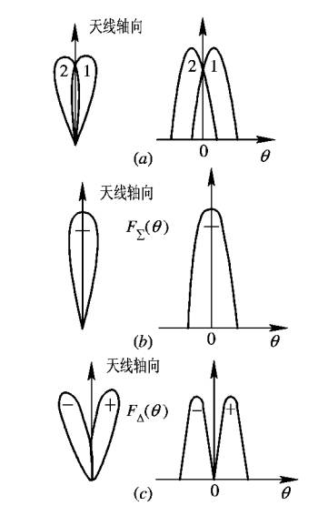
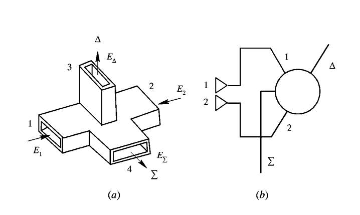

## **相位法测角**
### **两天线相位法测角基本原理**

利用电磁波在空间中传播到不同位置接收天线时产生的相位差，来反推目标的方向（角度）。

其本质是将空间上的距离差，转化为相位差，再通过测量相位差来解算角度。

电磁波每传播一个波长 $\lambda$ 的距离，相位变化$2\pi$。

$$\varphi =\frac{2\pi dsin\theta }{\lambda }$$

$$\theta =arcsin(\frac{\varphi \lambda }{2\pi d} )$$

::: tip

短基线保证大的无模糊测角范围。

长基线保证高的测角精度。

:::

### **测角误差分析与多值性**

### **多基线测角**

$\varphi _{12}=\frac{2\pi }{\lambda }d_{12}sin\theta <2\pi$

$\varphi _{13}=\frac{2\pi }{\lambda }d_{13}sin\theta =2\pi N+\psi$

式中，$\psi$，$\varphi _{12}$，$\varphi _{13}$都可以读出数值，根据读数确定$N$的值。进而计算出$\varphi _{13}$更为精确的值，最后，推断出$\theta$的值。

## **振幅法测角**

### **最大信号法**

==工作过程==

雷达天线在转动，当回波弧度最大时所测得角，即为当前角度。

### **等信号法**

::: tip
两天线方向图相同，交叠位置大约在3分贝处。
:::

==工作原理==

* 比幅法

天线波束：天线产生两个完全相同的波束，它们在空间上关于天线轴对称，并有一部分重叠。重叠区域的中心线就是“等信号轴”。

波束A的方向图函数为 $F(\theta - \theta_0)$

波束B的方向图函数为 $F(\theta + \theta_0)$

其中 $\theta_0$ 是单个波束最大值方向与等信号轴（$\theta=0$）的夹角。

信号接收：当目标位于方向 $\theta$ 时（$\theta$ 是相对于等信号轴的偏角），两个通道接收到的信号电压幅度分别为：

$u_A = k F(\theta - \theta_0)$

$u_B = k F(\theta + \theta_0)$

$k$ 是一个与距离、目标反射率等有关的常数。

计算幅度比：系统计算两个信号的幅度比（或差值）。比值 $R$ 与目标的偏角 $\theta$ 有确定的函数关系：

$R = \frac{u_A}{u_B} = \frac{F(\theta - \theta_0)}{F(\theta + \theta_0)}$

或者使用差值：$\Delta = u_A - u_B$

测角：

判别方向：如果 $u_A > u_B$ ($R>1$, $\Delta>0$)，说明目标偏在等信号轴的A侧；反之，则偏在B侧。

判别大小：比值 $R$ 的大小直接反映了目标偏离等信号轴的角度 $\theta$ 的大小。通过预先标定好的 $R-\theta$ 曲线（称为“角误差特性曲线”），就可以精确计算出偏角 $\theta$ 的值。

实现等信号：在自动跟踪系统中，这个误差信号 $\Delta$ 会被反馈给伺服系统，驱动天线转动，使 $\Delta$ 趋向于零。当天线对准目标时，$\theta=0$，则 $u_A = u_B$，$\Delta=0$，天线停止转动。

优点：原理简单直观。
缺点：测角精度依赖于两个通道（放大器、接收机等）的幅度一致性。如果两个通道的增益特性有微小差异，就会直接带来测角误差。

* 和差法

和差法同样使用两个重叠的波束，但它利用微波网络（如魔T、双T、3dB电桥等）形成“和”信号（$\Sigma$）与“差”信号（$\Delta$），从而将角误差信息蕴含在信号的相位中，而相位比对幅度的一致性不敏感。

天线波束与和差网络：

两个馈源（或阵列）分别产生波束A和B。

通过一个微波和差比较器（ magic-T ）：

和通道：$\Sigma = u_A + u_B$

差通道：$\Delta = u_A - u_B$

信号特性：

和信号 $\Sigma$：其方向图是两个波束的叠加。在等信号轴方向 ($\theta=0$) 有最大值，用于测距和作为相位参考基准。

差信号 $\Delta$：其方向图呈奇对称。在等信号轴方向 ($\theta=0$) 为零值（谷点），越偏离零点，信号幅度越大。其相位（0°或180°）则代表了偏离的方向。

测角原理：

当目标偏离等信号轴时，$\Delta \neq 0$。

判别方向：将差信号 $\Delta$ 与和信号 $\Sigma$ 进行相位检波。

如果目标偏在A侧，则 $\Delta$ 与 $\Sigma$ 同相。

如果目标偏在B侧，则 $\Delta$ 与 $\Sigma$ 反相（相位差180°）。

判别大小：误差电压的大小正比于 $|\Delta| / |\Sigma|$，即差信号与和信号的幅度比。这个比值与偏角 $\theta$ 成正比。

误差电压 $V_{error} \propto \frac{|\Delta|}{|\Sigma|} \approx k \theta$ （在小角度下近似线性）

实现等信号：自动跟踪系统根据误差电压的极性（相位） 判断驱动方向，根据大小判断驱动速度，最终使天线对准目标，此时 $\Delta = 0$，误差电压为零。

优点：

高精度：利用相位信息判别方向，对接收机通道的幅度增益一致性要求大大降低。

高数据率：理论上可以从一个脉冲回波中同时获得“和”、“差”信息（故名“单脉冲”），避免了目标起伏带来的误差，数据率高，适合跟踪高速目标。

缺点：系统复杂，需要和差网络和多通道接收机（至少需要和、差两个通道）。

==特点==

优点：便于角度跟踪

缺点：最大作用距离小于最大信号法

## **自动测角的原理和方法**

### **圆锥扫描自动测角系统**

==基本原理==

### **单脉冲自动测角系统**

* (a)两馈源形成的波束

* (b)和波束

* (c)差波束

==振幅和差式单脉冲工作过程==

* 雷达发射过程

    将发射信号输入$\sum$端，$\bigtriangleup$端无输出。1，2端输出同幅同相信号。

* 雷达接收过程

    双T接头的1，2端输入。$\bigtriangleup$端输出差信号，$\sum$端输出和信号。
