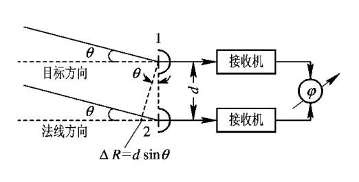
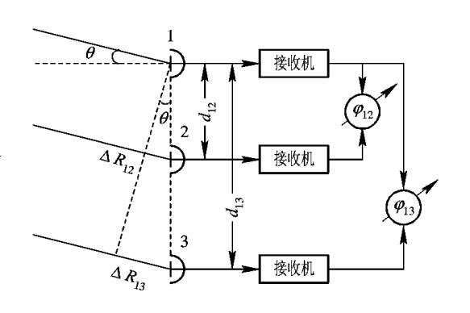
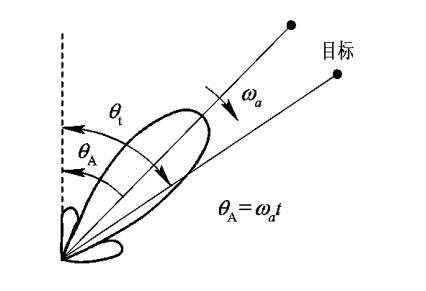
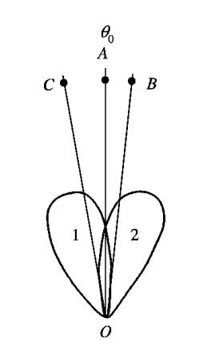
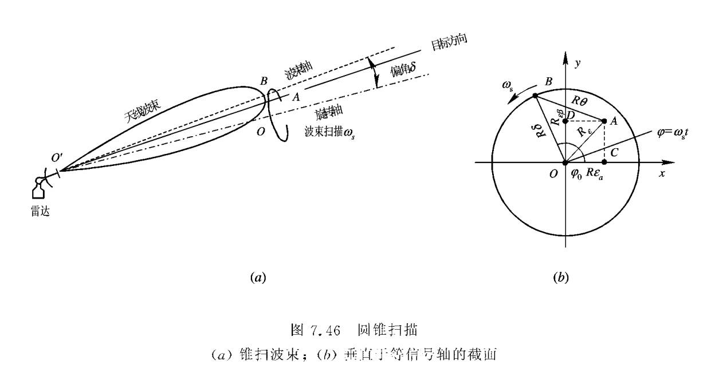

## **两天线相位法测角基本原理**

利用电磁波在空间中传播到不同位置接收天线时产生的相位差，来反推目标的方向（角度）。

其本质是将空间上的距离差，转化为相位差，再通过测量相位差来解算角度。

电磁波每传播一个波长 $\lambda$ 的距离，相位变化$2\pi$。

$$\varphi =\frac{2\pi dsin\theta }{\lambda }$$

$$\theta =arcsin(\frac{\varphi \lambda }{2\pi d} )$$

短基线保证大的无模糊测角范围。

长基线保证高的测角精度。

## **多基线测角**

$\varphi _{12}=\frac{2\pi }{\lambda }d_{12}sin\theta <2\pi$

$\varphi _{13}=\frac{2\pi }{\lambda }d_{13}sin\theta =2\pi N+\psi$

式中，$\psi$，$\varphi _{12}$，$\varphi _{13}$都可以读出数值，根据读数确定$N$的值。进而计算出$\varphi _{13}$更为精确的值，最后，推断出$\theta$的值。

## **振幅法测角**

### **最大信号法**

### **等信号法**

* 比幅法

* 和差法

==特点==

优点：便于角度跟踪

缺点：最大作用距离小于最大信号法

## **自动测角的原理和方法**

### **圆锥扫描自动测角系统**

==基本原理==

### **单脉冲自动测角系统**

==振幅和差式单脉冲工作过程==

* 雷达发射过程

    将发射信号输入$\sum$端，$\bigtriangleup$端无输出。1，2端输出同幅同相信号。

* 雷达接收过程

    双T接头的1，2端输入。$\bigtriangleup$端输出差信号，$\sum$端输出和信号。

==理论分析==