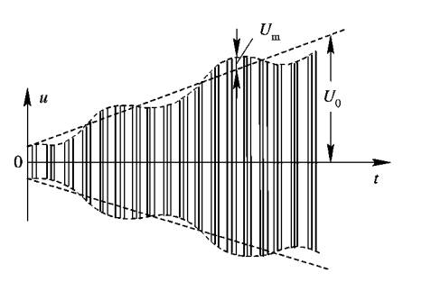

## **波束形状与扫描方式**

### **波束形状**

* 扇形波束

* 针状波束

### **扫描方式**

* 机械性扫描

* 电扫描

::: tip
波束扫描不是雷达旋转一周，而是在目标区域尽心环绕扫描。
:::

## **相位扫描法**

::: note
使用电扫描，控制相控阵实现天线方向图的改变。
:::

### **回波信号示意图**

通过观察回波信号的示意图发现，回波信号的幅度是不平整的，通常使用自动增益控制电路，用于消除目标距离以及截面积大小对输出幅度的影响。

### **基本原理**

通过移相器实现

==天线方向图函数==

$$F(\theta )=\frac{1}{N} \begin{vmatrix}\dfrac{sin\frac{N}{2}(2\pi d sin \theta  -\varphi  ) }{sin\frac{1}{2}(2\pi d sin \theta  -\varphi}\end{vmatrix}$$

$$\varphi =\dfrac{2\pi d sin \theta _0}{\lambda }$$ 

### **栅瓣问题**

### **波束宽度**

采用3dB

$$\theta _{0.5}=\theta _{3dB}=\dfrac{0.886\lambda }{Ndcos\theta _0} =\frac{50.8\lambda }{Ndcos\theta _0}$$ 

$\theta _{0.5}$：半功率