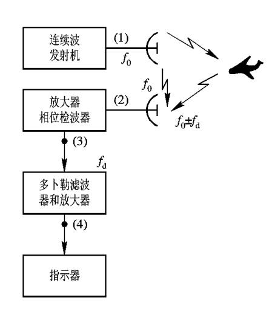
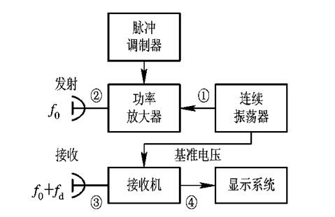
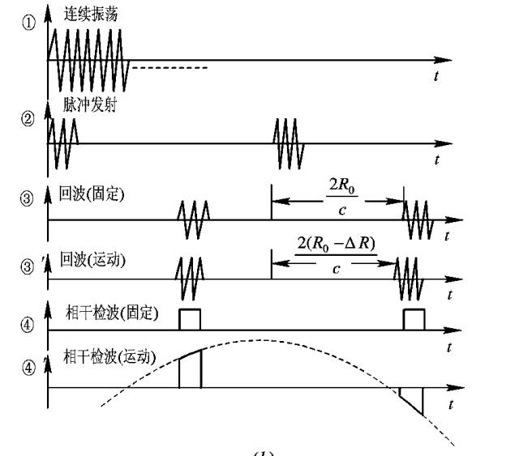

## **多普勒效应**

雷达接收机将接收到的回波信号与发射信号进行混合，产生一个差频信号。这个差频信号的频率正好就是多普勒频移。

通过频谱分析（如使用FFT快速傅里叶变换）等技术，精确地测量出这个差频的值。

由于发射频率是已知的，根据公式反解出速度：

$$v=\frac{f_d \cdot \lambda }{2}=\frac{f_d \cdot c}{2f_t}$$

### **连续波雷达**

### **多普勒雷达**

## **多普勒信息的提取**

### **连续波雷达**
相位检波器

### **脉冲多普勒雷达**

## **盲速和频闪**

### **盲相**

盲相指的是，当雷达使用相干检波（即通过比较发射信号和接收信号的相位差来提取多普勒信息）时，由于采样方式（脉冲工作模式）的限制，对于某些特定相位关系的回波信号，其多普勒信息会完全丢失的现象。

简单来说，就是雷达“看不见”某些相位变化的回波，导致无法检测到目标的存在或测出其速度。

雷达发射的是脉冲串，相当于在连续时间上以脉冲重复频率（PRF） 进行采样。

连续波情况：如果一个目标在移动，其回波会产生连续的相位变化，雷达可以完美地检测出这个变化率（即多普勒频率）。

脉冲波情况：雷达只在每个脉冲发射后的短暂时刻进行采样（接收）。如果目标移动导致回波的相位变化正好是360°（2π弧度）的整数倍，那么相邻两个脉冲采样时刻看到的回波相位将是完全相同的。

::: tip
当目标的多普勒频率 $f_d$ 正好是脉冲重复频率 $PRF$ 的整数倍时，就会发生盲相，导致测速失败。
:::

### **盲速**

盲速是盲相概念在速度维度上的直接体现。它指的是那些会导致多普勒频率 f_d 恰好为PRF整数倍，从而引发盲相现象的特定目标径向速度。

处于盲速的目标，其回波在脉冲采样点上看不出任何相位变化，因此会被雷达误判为静止目标。

::: note 
消除盲速的方法不是让盲速彻底没有，而是增加第一盲速的值，当速度小于第一盲速时，则能保证速度的测量。
::: 

::: tip

当一个目标以“盲速”运动时，它在雷达上就会表现出“盲相”的症状。

:::

### **频闪**

频闪效应是盲相和盲速现象产生的物理机制和直观比喻。 正是由于雷达这种“频闪”式的工作方式，才导致了在某些特定条件下（相位同步或速度同步），运动目标被“伪装”成了静止目标。

避免频闪的条件：$|f_d| < \frac{1}{2}f_r$