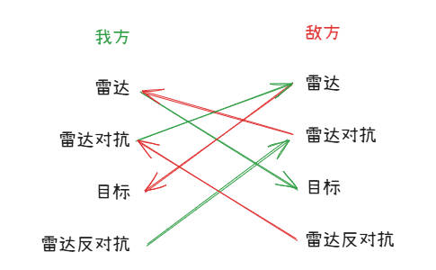
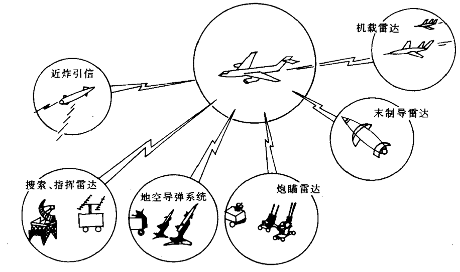
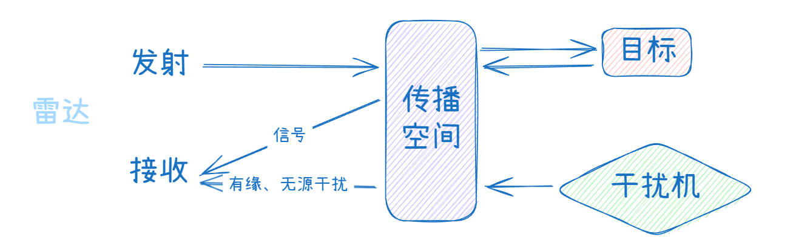

## **雷达对抗含义**
---
### **含义**

雷达对抗是一切从敌方雷达及其武器系统获取信息（雷达侦察），破坏或扰乱敌方雷达及其武器系统的正常工作（雷达干扰和雷达攻击）的战术、技术措施的总称。

雷达对抗
* 雷达侦察（手段）

    测距、测角、测速。

* 雷达干扰（目的）

    对雷达信号进行干扰、直接对雷达进行破坏、雷达隐身。

::: tip
只侦察不干扰如任何损失，但不侦察只干扰是无法进行的。
:::

我方雷达对敌方目标进行探测，敌方为了不被探测使用雷达对抗对我方雷达进行干扰，我方为了不被干扰使用雷达反对抗对敌方雷达对抗装置进行干扰。

::: warning
在现代战场中，若不进行雷达对抗，作战装备（人员）是无法生存的。
:::

### **脉冲描述字**

雷达脉冲描述字（Pulse Descriptor Word, PDW）是电子战（EW）和信号情报（SIGINT）系统中用于描述雷达脉冲特征的关键参数集合，通常用于脉冲的检测、分类、识别和跟踪。以下是常见的PDW参数：

* $f_{RF}$：载波频率（RF, Radio Frequency）

    脉冲的中心频率（如8 GHz、10 GHz等）。

* $t_{TOA}$：到达时间（TOA, Time of Arrival）

    脉冲到达的时间戳，用于计算脉冲重复间隔（PRI）。

* $\tau _{pw}$：脉冲宽度（PW, Pulse Width）
    
    脉冲的持续时间（如1 μs、10 μs等）。

* $A_p$：脉冲幅度（PA, Pulse Amplitude）

    脉冲的信号强度（通常用dBm表示）

* $\theta_{AOA}$：到达角（AOA, Angle of Arrival）

    脉冲的入射方向（方位角、俯仰角）。

* $F$：脉冲内调制特征。

### **重要性**

1. 取得军事优势的重要手段和保证。

2. 武器系统个军事目标生存与发展的必不可少的自卫手段。

::: info 侦察天线和干扰天线收发共用问题

侦察天线和干扰天线`不能`收发共用，因为侦察和干扰是同时进行的。

:::

## **电子对抗频段划分**

1. 射频对抗

2. 光电对抗

3. 声学对抗

## **雷达侦察过程**

雷达发射 --> 传播空间 --> 侦察机

==条件==

1. 雷达发射

2. 侦察机收到信号大于侦察接收机灵敏度

3. 雷达参数在侦察设备检测能力范围内

## **雷达干扰基本原理**

1. 通过主动发射电磁波干扰敌方雷达或通信系统，使其无法正常探测或通信。

2. 减小$\sigma$

* $P_{rj}$：有源干扰

| **干扰类型**                     | **原理**                                                                 | **典型应用**                     |
|----------------------------------|--------------------------------------------------------------------------|----------------------------------|
| 噪声干扰（Noise Jamming）        | 发射宽带或窄带噪声，淹没目标信号（类似“盖住”敌方雷达回波）。              | 压制雷达、通信系统（如 Barrage Jamming）。 |
| 欺骗干扰（Deception Jamming）    | 发射虚假信号（如假目标、距离/速度欺骗），误导雷达跟踪。                   | 对抗导弹制导雷达（如 DRFM 技术）。 |
| 距离门拖引（RGPO）              | 逐步延迟复制雷达信号，诱使雷达跟踪错误距离。                              | 对抗脉冲雷达（如战斗机自卫干扰）。 |
| 速度门拖引（VGPO）              | 调制多普勒频率，诱使雷达跟踪错误速度。                                    | 对抗脉冲多普勒雷达（如机载干扰机）。 |
| 相干干扰（Coherent Jamming）     | 精确复制雷达信号并调制相位/频率，实现高逼真度欺骗。                       | 对抗先进雷达（如 AESA 雷达）。 |

干扰类型：噪声干扰

* $P_{rc}$：无源干扰

通过反射/散射电磁波干扰敌方雷达，不主动发射信号，依赖环境或投放物。

| **干扰类型**                     | **原理**                                                                 | **典型应用**                     |
|----------------------------------|--------------------------------------------------------------------------|----------------------------------|
| 箔条（Chaff）                   | 投放金属箔条（如铝镀膜玻璃纤维），形成雷达假目标。                        | 对抗导弹末制导（如舰载/机载投放）。 |
| 角反射器（Corner Reflector）     | 部署金属结构（如三角形/立方体），强烈反射雷达波。                         | 模拟大型目标（如诱骗雷达制导武器）。 |
| 等离子体干扰                     | 利用电离气体（如火箭尾焰）散射雷达波。                                    | 导弹突防（如高超音速飞行器）。 |
| 隐身材料（RAM）                  | 吸波材料（如铁氧体涂层）减少目标 RCS。                                    | 降低被探测概率（如 F-35 隐身涂层）。 |

## **雷达对抗技术特点**

1. 宽频带、大视场

2. 瞬时信号检测、高速信号处理