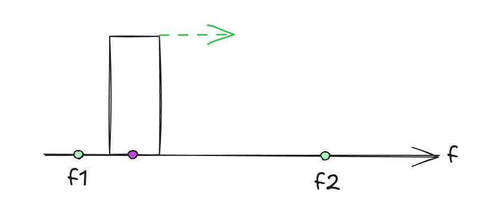
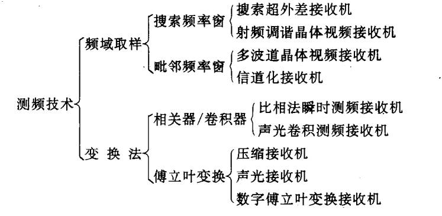

## **主要技术指标**

### **测频时间**

测频时间是接收机从截获信号到输出频率结果所用的时间。

直接影响雷达系统的反应速度，尤其在电子战（EW）或快速变化的电磁环境中。

较短的测频时间可提升对高速目标的跟踪能力。

### **测频范围**

$\Omega _{RF}\in [f_1,f_2]$

接收机能够测量的信号频率的最小值到最大值范围，通常以GHz或MHz为单位。

==测频原理==

类似于广播调台，进行频率搜索，当搜索到信号及有信号输出。

### **接收机带宽**

接收机瞬时能够处理的信号频率范围，通常指中频（IF）带宽。

### **搜索概率**

在存在噪声和干扰的情况下，雷达正确检测到目标的概率。

### **测频精度**

频率测量值与真实值的偏差，通常以MHz或百分比表示（如±1MHz）。

测频精度与$\bigtriangleup f_r$有关，测频精度为$\dfrac{ \bigtriangleup f_r}{2}$。

## **测频技术分类**

