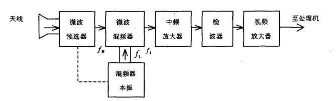
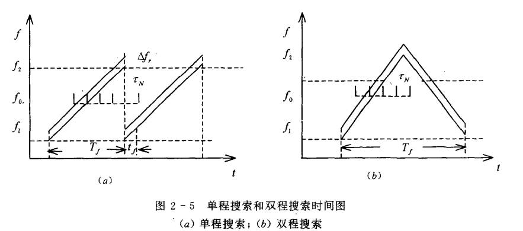
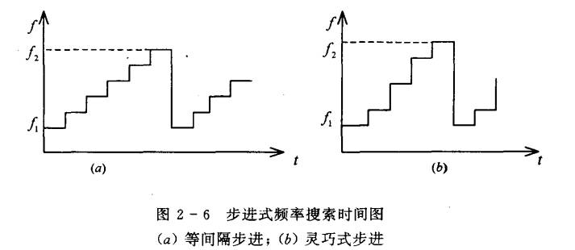
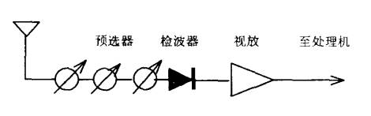

## **频率搜索接收机**

### **搜索式超外差接收机**

::: note 什么是超外差

`超外差`是本振频率减射频频率等于中频频率

`低外差`是射频频率减本振频率等于中频频率
:::

==工作模式与过程==

其核心是扫频超外差原理。

接收到的射频信号先经过一个可调谐的预选滤波器（通常与本地振荡器统调），初步滤除带外干扰。信号与一个频率扫描（搜索）的本地振荡器产生的本振信号在混频器中混频，产生固定的中频信号。中频信号经过放大和窄带中频滤波器的处理。由于中频固定且较低，可以设计得非常陡峭，从而获得极高的频率选择性和增益。经过中频处理后的信号可以被检波、视频放大后显示为频谱（全景显示接收机），或进一步进行数字化和解调等处理。通过控制本振的扫描规律，系统就能实现对整个频段的搜索。

* 微波预选器

    微波预选器的通带$[f_0(t)-\frac{\bigtriangleup f_r}{2} ,f_0(t)+\frac{\bigtriangleup f_r}{2} ]$，$f_0(t)$是中心频率；移动速度为：$v_f=\frac{f_2-f_1}{T}$。

* 混频器本振

    混频器的本振的频率是一直在变换的，需要保证频率比微波预选器的频率大中频频率。

* 中频放大器

    中频放大器的带宽与微波预选器的带宽相等为$\bigtriangleup f_r$;中心频率$f_i$是不变的。带宽为通带$[f_i(t)-\frac{\bigtriangleup f_r}{2} ,f_i(t)+\frac{\bigtriangleup f_r}{2} ]$

* 检波器

    检波器有输出（过门限）的条件：$f_R \in [f_0(t)-\frac{\bigtriangleup f_r}{2} ,f_0(t)+\frac{\bigtriangleup f_r}{2} ]$，$f_R$为雷达信号。当检波器有输出时，$f_0$为雷达的中心频率。

==频率搜索形式==

连续搜索：本振频率连续线性变化

步进搜索：本振频率以一定的步进间隔跳跃变化。还有一种“灵巧步进”，在信号密集区细搜，在空白区大步跳过，提高搜索效率，在密集频段，逐步跳跃，在雷达空白频段，大步越过，这样便缩短了搜索周期，提高了搜索概率。宽带预选超外差接收机可以采用灵巧式搜索方式。

==存在的问题==

由于混频器是非线性作用，在输出端会产生许多频率的信号，最主要的信号是境频。

采用宽带滤波-高中频接收，增大中频，使镜频远离信号。保证$f_i > 0.5(f_2-f_1)$。其中$f_i$,$f_1$,$f_2$分别为中频、侦收波段和最高频率。

### **射频调谐晶体视频接收机**

==工作模式与过程==

射频调谐（可选）：接收到的射频信号可能先经过一个可调谐的带通滤波器进行预选，以限制瞬时带宽，提高选择性。但也有很多晶体视频接收机省去此步骤，直接接收极宽频带。

直接检波：射频信号被直接送入晶体二极管（如肖特基二极管）进行检波。二极管具有非线性特性，能提取出信号的包络（即视频信号）。

视频放大：检波产生的视频信号通常很微弱，需要经过视频放大器进行放大。

门限比较与输出：放大后的视频信号与一个门限电平进行比较，超过门限则判定为有信号，并输出脉冲或进行告警。

==存在的问题==

预选器的带宽决定了搜索精度，但是在射频信号中，很难将预选器的带宽做窄。

## **频率搜搜速度的选择**

* 脉冲群宽度$\tau_N$；

* 脉冲宽度$\tau$；

* 搜索周期$T_f$；

* 脉冲群内脉冲数$Z_N$；

* 脉冲重复周期$T_r$

### **慢可靠**

在雷达脉冲群存在期间，侦察接收机搜索完整个测频范围。

慢可靠就像一个耐心的钓鱼人。他知道鱼群（雷达脉冲串）会在这片水域持续活动一段时间。于是他不慌不忙地、一杆接一杆地（一个频率接一个频率地）在整个湖面（测频范围）抛下鱼饵。虽然动作慢，但在鱼群消失前，他总有那么一杆能准确命中，稳稳地钓上好几条鱼（截获多个脉冲），从而清楚地知道这是什么鱼。

$$T_f \le \tau_N = Z_N T_r$$

## **快可靠**

在脉冲宽度内，侦察接收机要搜索完整个侦察阶段。

快可靠则像一道瞬间照亮夜空的闪电。它的目标是在一声短暂的雷鸣（一个雷达脉冲）持续的那一刹那，就用极强的光芒（超高速搜索）扫过整片天空（整个侦察频段），瞬间看清所有云朵的细节。这道光快得让任何短暂出现的飞鸟（信号）都无所遁形，立即被捕捉和识别。

频率搜索速度满足：
$$v_f=\frac{f_2-f_1}{T_f}\ge  \frac{f_2-f_1}{\tau }$$
