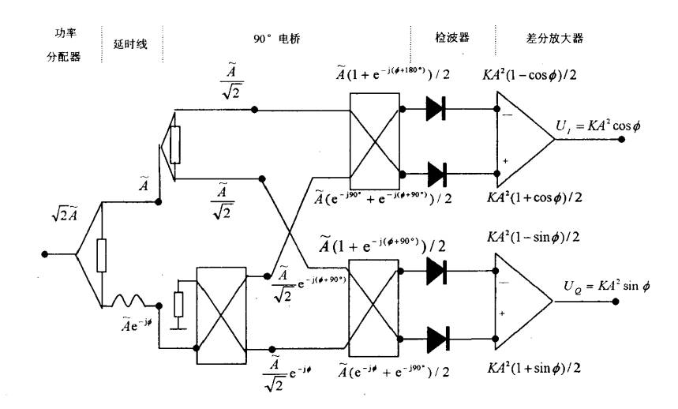
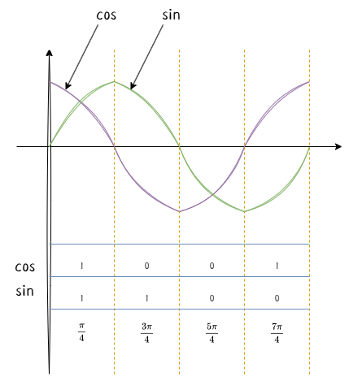
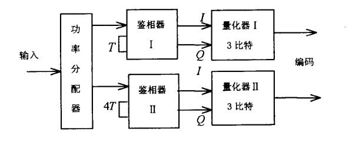

## **鉴相器**

### **简单鉴相器**

鉴相器的核心功能是检测两个输入信号之间的相位差，并将这个相位差转换为一个直流或低频的电压信号输出。实现信号的自相关算法，得到信号的自相关函数。

* $u_1=\sqrt{2} Ae^{j \omega t}$

::: tip 注
因为是对功率进行分配，$\sqrt{2} Ae^{j \omega t}$分成2路相同功率每路为$Ae^{j \omega t}$。
:::

* $u_2=u_3=Ae^{j \omega t}$

* 点2到点4相移为0。

    $u_4=u_2$

* 点3到点5有时延。

    $u_5=Ae^{j(\omega t-\phi)}$

    $\phi =\omega T=\frac{\omega \bigtriangleup L}{c_g}$

    其中，$T$为延时时间，$\bigtriangleup L$为延时线长度，$c_g$为电磁波在延时线传播速度。

* $u_6=Ae^{j\omega t}(1+e^{-j\phi })$

* 经平方律检波器，输出视频电压为：

    $|u_6|=\sqrt{2} A\sqrt{(1+cos\phi )}$

    输出是一个直流电压，其大小随频率 $f$ 呈余弦变化。

    ::: note 平方律检波器
        平方律检波器是一种将高频信号的功率线性地转换为直流电压的电路手段。

    平方律检波器是一种利用二极管非线性特性工作的电路，当其输入信号功率较弱时，输出直流电压会与输入高频信号功率（或电压的平方）成正比，从而能够将信号的幅度信息线性地转换为直流电压，广泛应用于功率检测、幅度解调和相位鉴别等领域。
    :::

鉴相器所测频范围为：$\Omega_{f_1,f_2}=f_2-f_1$

鉴相器的核心为：

相移与频率之间的关系：

$\phi =\omega T=2\pi fT$

$\bigtriangleup F=\Omega _{RF}=\frac{1}{T}$

小$T$保证大的测频范围，大$T$保证测频精度。

::: tip 本质

微波鉴相器的本质是一个自相关器。

它通过让信号的一个副本与它自身经过延迟的另一个副本进行相干（相加），然后检测其合成功率，从而提取出信号的频率（或相位）信息。输出信号 $u_7$ 的幅度随频率 $f$ 和固定延迟时间 $T$ 的变化而成余弦变化。

:::

### **正交鉴相器**

正交鉴相器可以看作是两个简单鉴相器的智能组合。

正交鉴相器是一种能够同时检测出两个输入信号之间相位差和幅度比的高级鉴相器。它的核心输出是两个正交的（即相位相差90°的）电压信号，通常称为 I（同相） 和 Q（正交） 分量。

### **极性量化器**

根据函数值的正负，进行编码，大于0编码为1，小于0编码为0。具体输出的测量值为范围的中间值。

区间个数为$2^m$个，对应的bit为$m$个bit。

区间取得越多，测量精度越高。

### **多路鉴相器的并行运用**

量化单元数$n=\frac{\bigtriangleup F}{\bigtriangleup f}$

多路鉴相器的T是等比变化的。

测频精度：$\bigtriangleup f=\frac{1}{2^mn^{k-1}T}$

* $m$：低位鉴相器支路的量化比特数

* $n$：相邻支路鉴相器的迟延时间比

* $k$：并行运用支路数

### **对同时到达信号的分析与检测**

1. 第一类同时到达

2. 第二类同时到达