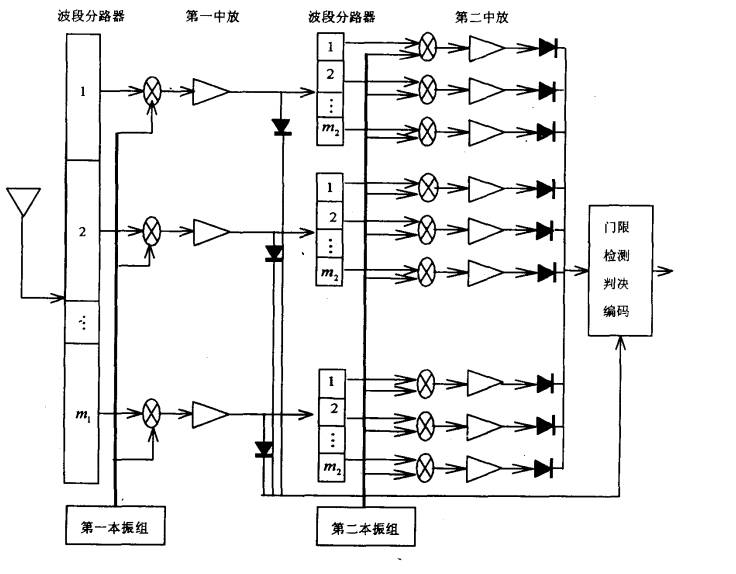
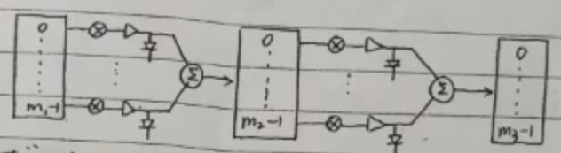

## **纯信道化接收机**

它就像派出了成千上万个耳朵，每个耳朵只专心听一个非常窄的频道，所有耳朵一起工作，就能瞬间听清整个交响乐团所有乐器的声音，一个不落。

### **基本原理**

侦察频段$[f_1,f_2]$进行n次分路$(i=1,2 \cdots )$，每一分路每次分频的路数为$m_i$，第$i$次分路第$j$次分频的本振频率为$f_{Li,j}$；第$i$次变频后的中放中心频率为$f_{Ii}$，中放带宽为$\bigtriangleup f_{ri}$。

$$f_{I0}=\frac{f_1+f_2}{2} $$ 

$$\bigtriangleup f_{r0}=f_2-f_1$$

$$f_{Ii}>\frac{\bigtriangleup f_{r(i-1)}}{2}$$

$$\bigtriangleup f_{ri}=\frac{\bigtriangleup f_{r(i-1)}}{m_i}$$

每级中放的带宽是前一级带宽的$\frac{1}{m_i}$，中放的中心频率要大于整个前一级的0.5倍频率差。

整个系统的带宽等于最后一路的带宽$=\dfrac{f_2-f_1}{\prod m_i}$

### **特点**

全局性：一次性处理整个目标频段，输出所有信道。

高分辨率：信道间隔可以做得非常小，频率分辨率高。

无盲区：各信道完美邻接，覆盖整个频段，无频谱遗漏。

并行输出：所有信道结果同时计算和输出。

结构固定：信道数目、带宽和位置在设计时就已固定

### **优点**

实时性好：能够实时、无遗漏地监测整个宽频带内的所有信号，非常适合宽带侦察和监测场景。

高灵敏度：由于每个信道都经过高效滤波，带外抑制好，能检测到微弱信号。

无频率盲点：避免了因扫描步进可能错过短时信号的问题。

处理效率高：通过多相结构和FFT的巧妙结合，计算效率远高于用大量独立滤波器并联的实现方式。

### **缺点**

资源消耗大：即使结构高效，但其计算量和硬件资源（如FPGA的逻辑单元、存储器、乘法器）消耗依然非常巨大，尤其是当信道数非常多、带宽非常宽时。

灵活性差：信道划分方案是固定的。如果只对少数几个频点感兴趣，它仍然需要计算所有信道，造成巨大的资源浪费。

实现复杂：算法结构和硬件实现相对复杂。

## **折叠信道化**

### **特点**

适合检测单一信号。

选择性：只针对感兴趣的频点进行处理。

灵活性高：信道中心频率、带宽等参数可以在一定范围内动态配置

### **优点**

资源效率高：计算资源只用于有信号的区域，极大节省了硬件和计算资源。在频谱稀疏（信号少）的场景下优势极其明显。

输出数据量小：每个信道经过降采样，输出速率低，减轻了后端处理（如DSP或CPU）的负担。

易于扩展：需要同时处理的信号增多时，可以增加处理支路（如果资源足够）。

### **缺点**

存在盲区风险：如果感知阶段漏掉了某个短时信号（如低截获概率信号），则该信号会被完全忽略，无法被处理。不适合需要100%截获率的监视场景。

实时性取决于感知：整体性能依赖于前端频谱感知的速度和精度，会引入一定的处理延迟和复杂度。

对突发信号不友好：在感知间隔内出现的信号可能无法被及时调度和处理。