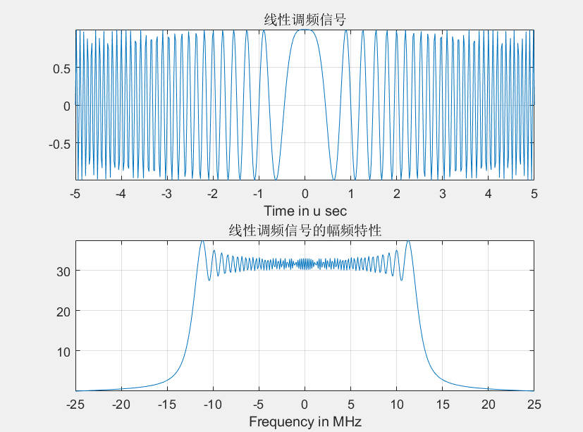

## 完整代码
```matlab
%% 线性调频信号的产生
clc;close all;clear all;

T = 10e-6;                          %脉宽
B = 25e6;                           %信号带宽
K = B/T;                            %调频斜率
Fs = 2*B;Ts = 1/Fs;                 %采样频率及采样间隔
N = T/Ts;
t = linspace(-T/2,T/2,N);
St = exp(j*pi*K*t.^2);            %生成线性调频信号

figure;
subplot(211)
plot(t*1e6,St);
xlabel('Time in u sec');
title('线性调频信号');
grid on;axis tight;
subplot(212)
freq = linspace(-Fs/2,Fs/2,N);
plot(freq*1e-6,fftshift(abs(fft(St))));
xlabel('Frequency in MHz');
title('线性调频信号的幅频特性');
grid on;axis tight;
```
## 实验效果

::: demo-wrapper img no-padding

:::